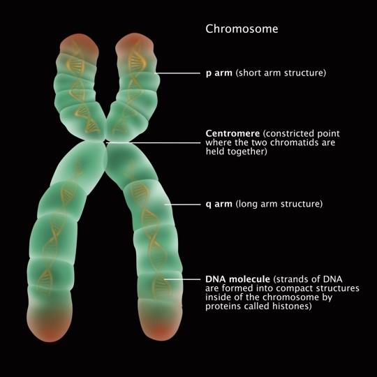
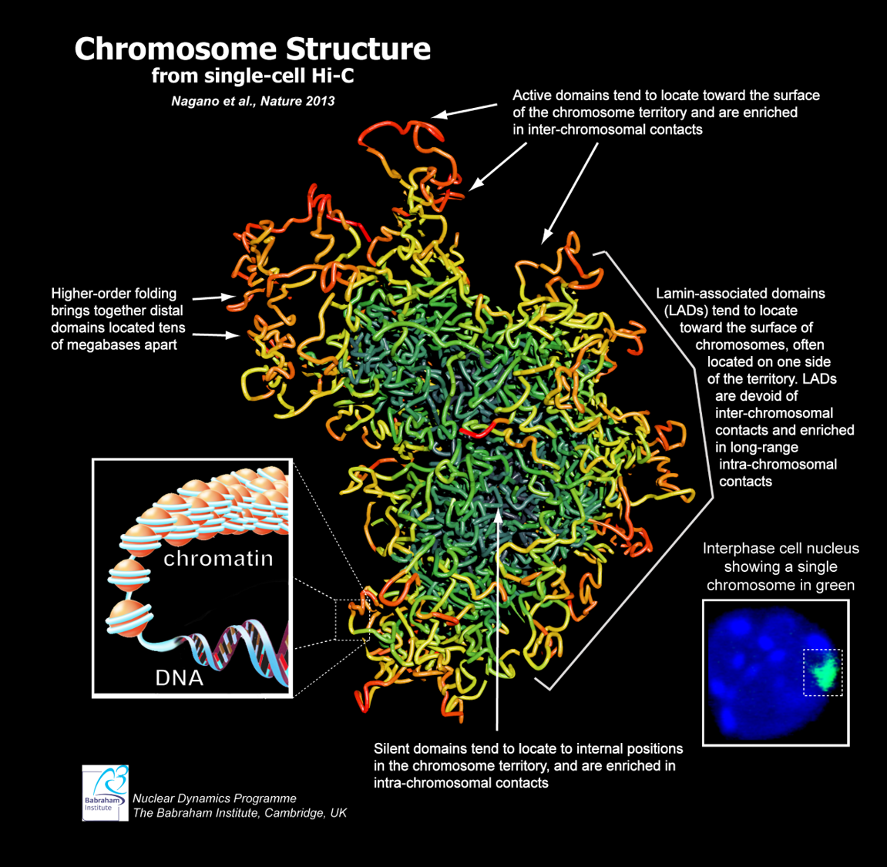
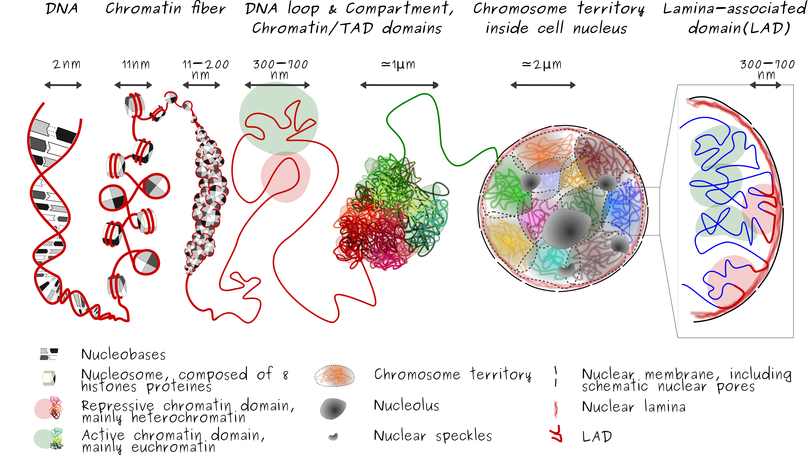

# Chromosome

고등학교에서 우리는chromosome (염색체)는 인간 세포에 총 46개가 있다고 배운다. 그리고 X자 모양의 염색체가 그려져 있고, 세포 분열할 때 양쪽으로 뜯어져서 각각 나눠진다고 알고 있다.&#x20;

<figure><figcaption>
Chromosome을 일반적으로 설명할 때 나타내는 그림. X자 형태로 그리는 것이 특징이다.
</figcaption></figure>

Chromosome에 대해 아주 좋은 설명이지만, 사실 실제 chromosome은 이보다 더욱 세세한 형태들로 이루어져 있다. 예를 들어, 위 그림의 chromosome은 한 쌍의 chromatids (염색분체)로 이루어져 있다. 이 chromatids 쌍은 세포 분열을 위해서 DNA가 2배로 복제된 것이 합쳐진 것이다. 즉, 일반적인 경우에는 저렇게 2개의 똑같은 DNA 덩어리가 붙어서 존재하지 않다는 것이다. 그럼 실제 chromosome은 어떤 형태로 있을까?

## Chromosome의 실제 형태

<figure><figcaption>
Hi-C로 측정한 데이터로 재구성한 chromosome의 구조. (Nagano et al., Nature 2013). 전체 genomic DNA가 아니라 오른쪽 하단에 초록색으로 표시된 영역의 1개의 chromosome만을 표현한 것이다.
</figcaption></figure>

평소의 chromosome은 위 그림과 같이 실 뭉치가 대충 엉켜있는 형태로 존재한다. 사실 이런 형태가 X자 형태보다 훨씬 자연스럽다. X자 형태로 꽉꽉 뭉쳐져 있으면 DNA에 그 어떤 단백질도 다가가기 힘들고 유전자에서 전사 - 번역 등의 과정도 일어나기 힘들 것 같기 때문이다.&#x20;

위 그림에서보면, chromosome에서도 색이 구분되어 그려져 있는데, 이는 해당 부분이 얼마나 활성화된 영역인지를 나타낸다. 예를 들어, 바깥쪽으로 자유롭게 노출되어있는 영역은 붉은 색으로 표시되어 있다. 이는 'active domain'이라고 한다. 이렇게 chromosome 내에서도 chromatin fiber의 위치와 형태에 따라서 구조적 domain이 나뉜다.  Chromosome의각각의 domain에 대해서 자세히 알아보자.

## Chromosome의 다양한 domain들

### Lamin-associated domain (LAD)

각각의 chromosome은 핵 안에서 엉겨있는 형태로 자신만의 영역을 차지하는데, 이를 chromosome territory라고 한다. 세포의 핵 내부를 보면 chromosome들이 각각의 territory를 차지하고 있다. 이런 영역은 꽤 일정한 패턴으로 유지되는 것처럼 나타나는데, 이는 'Lamin-associated domain (LAD) 덕분이다. Lamin (또는는 lamina)는 세포의 핵의 모양을 유지시켜주는 그물망 형태의 단백질 구조체인데, chromosome의 LAD는 이 lamina에 달라붙어서 자신의 영역을 고정하기도 한다.&#x20;

<figure><figcaption></figcaption></figure>

