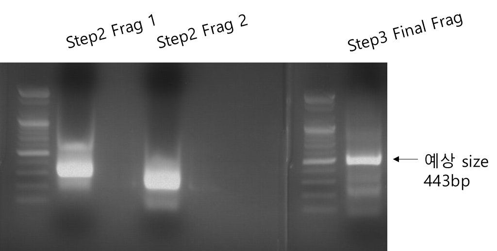

# Overlap extension PCR

Cloning을 하다보면, template이 없는 상황에서 긴 DNA fragment를 만들어야 할 경우가 있다. 만약 짧은 fragment의 경우에는 긴 primer 쌍을 주문해서 서로 PCR을 해서 얻어낼 수 있다.

하지만, 원하는 DNA sequence가 수 백 bp 수준으로 길어서 primer로 주문할 수 없는 경우가 있다. 아예 수 천 bp 수준으로 길면 gBlock 등으로 long fragment 합성 주문을 하고 기다리겠지만, 이는 비용도 비싸고 시간도 수 십일 이상으로 오래 걸린다.

만약 fragment가 수 백 bp 수준으로 비교적 짧은 경우에는, overlap extension PCR로 원하는 DNA fragment를 얻을 수 있다.

## Overlap extension PCR

<figure><figcaption>
Overlap extension PCR의 예시
</figcaption></figure>

Overlap extension PCR은 위와 같이 primer들을 길게 주문해서 증폭되는 fragment끼리 overlap이 생기도록 만들어준 후, 다시 그 fragment들을 함께 넣고 PCR을 해서 서로가 달라붙어서 증폭되도록 해주는 방법이다. Primer 혹은 fragment 사이의 overlap은 Tm이 63℃ 이상이 되도록 디자인 해준다.&#x20;

경우에 따라서는 2쌍 (총 4개 primer)를 한번의 reaction tube에 넣고 fragment를 한번에 만들어낼 수도 있으나, 잘 안 되는 경우도 종종 있으니 각 fragment를 따로 만들어주면서 단계별로 증폭해가는 것을 추천한다.

더 길이가 긴 fragment를 합성해야 할 때에는 primer 쌍을 연결될 수 있도록 계속 더 주문하고, PCR 개수를 늘리면 된다. 하지만 수 천 bp 이상부터는 long fragment 합성 주문을 추천한다. PCR 과정을 늘릴 수록 mutation이 생길 가능성이 높기 때문이다.

## 예시: 443bp fragment 합성

ShS15라는 DNA fragment를 합성하기 위해 사용했던 primer의 예시이다.&#x20;

<figure><figcaption>
합성하려는 DNA fragment와 사용할 primers
</figcaption></figure>

### PCR step 1

이하 모든 PCR은 Q5® High-Fidelity DNA Polymerase ([NEB, M0491L](https://international.neb.com/products/m0491-q5-high-fidelity-dna-polymerase#Product%20Information))을 사용했다.&#x20;

| Reagent                 | Volumn              |
| ----------------------- | ------------------- |
| Q5 polymerase           | 0.5 uL              |
| Q5 reaction buffer (5X) | 10uL                |
| FP (100pmol)            | 1uL                 |
| RP (100pmol)            | 1uL                 |
| dNTP                    | 1uL                 |
| D.W.                    | 36.5uL (up to 50uL) |

각 fragment를 증폭하기 위한 첫 PCR이다. 아래의 조합들로 primer를 넣어 PCR 했다.

| Target fragment | FP        | RP        |
| --------------- | --------- | --------- |
| Step1-Frag1     | ShS15\_F1 | ShS15\_R1 |
| Step1-Frag2     | ShS15\_F2 | ShS15\_R2 |
| Step1-Frag3     | ShS15\_F3 | ShS15\_R3 |

PCR: 98℃ (2min) - \[98℃ (25s) - 59℃ (25s) - 72℃ (30s)] x 30 cycles - 72℃ (3min) - 16℃

### PCR step 2

| Reagent                 | Volumn            |
| ----------------------- | ----------------- |
| Q5 polymerase           | 0.5 uL            |
| Q5 reaction buffer (5X) | 10uL              |
| FP (10pmol)             | 2.5uL             |
| RP (10pmol)             | 2.5uL             |
| Fragment A PCR product  | 5uL               |
| Fragment B PCR product  | 5uL               |
| dNTP                    | 1uL               |
| D.W.                    | 23.5 (up to 50uL) |


Fragment A/B PCR product는 purification 과정 없이 그대로 사용한 것.&#x20;


아래의 조합의 primer와 fragment를 사용했다. Step2-Fragment 2의 경우에는 3' end 쪽으로 추가 연장만 필요했기 때문에 fragment B가 없다.

| Target fragment | FP        | RP        | Frag A      | Frag B         |
| --------------- | --------- | --------- | ----------- | -------------- |
| Step2-Frag1     | ShS15\_F1 | ShS15\_R2 | Step1-Frag1 | Step1-Frag2    |
| Step2-Frag2     | ShS15\_F3 | ShS15\_R4 | Step1-Frag3 | X (D.W. added) |

PCR: 98℃ (2min) - \[98℃ (25s) - 59℃ (25s) - 72℃ (30s)] x 30 cycles - 72℃ (3min) - 16℃

### PCR step 3

| Reagent                 | Volumn              |
| ----------------------- | ------------------- |
| Q5 polymerase           | 0.5uL               |
| Q5 reaction buffer (5X) | 10uL                |
| ShS15\_F1 (10pmol)      | 2.5uL               |
| ShS15\_R4 (10pmol)      | 2.5uL               |
| Step2-Frag1             | 3uL                 |
| Step2-Frag2             | 3uL                 |
| dNTP                    | 1uL                 |
| D.W.                    | 27.5uL (up to 50uL) |

PCR: 98℃ (2min) - \[98℃ (25s) - 59℃ (25s) - 72℃ (30s)] x 25 cycles - 72℃ (3min) - 16℃

최종 product (step3 PCR)를 2% agarose gel에 내려봤을 때, 예상하는 사이즈에서 밴드가 나오는 것을 볼 수 있다. 이를 [gel purification](gel-purification.md)한 후, cloning 등 원하는 목적에 사용한다.&#x20;


PCR을 통해 얻은 것이므로, 반드시 sequencing해서 mutation 여부를 확인해야 한다.


<figure><figcaption>
Overlap extension PCR 결과
</figcaption></figure>


위 예시에서는 밴드가 강하게 나왔으므로, 양이 충분하다면 PCR cycle 수를 낮춰도 좋다.&#x20;

