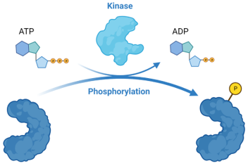

# PNK annealing

### Polynucleotide Kinase

Polynucleotide Kinase는 DNA 혹은 RNA 5’-말단의 ATP γ위치에 인산기  (phosphate)를 첨가하는 효소이다. 이렇게 5' 말단에 phosphate가 있으면, 다른 DNA / RNA과 이어서 붙을 수 있다. 따라서 ligation을 할 목적의 oligo에는 항상 5'에 PNK를 이용해서 phosphate를 붙여주거나, 합성할 때 modification 된 것으로 구매한다.&#x20;

Phosporylation을 시켜주는 효소는 흔히 kinase라고 한다. 흔히 ATP에 있는 3개의 phosphate 중 1개를 다른 곳에 옮겨 붙여주면서 작동한다.&#x20;

<figure><figcaption>
Kinase의 작동 
</figcaption></figure>

Kinase의 종류는 아주 많다. 목적에 따라서 적절한 kinase를 사용할 수 있으며, 이미 연구도 많이 되어 있다.&#x20;

<table><thead><tr><th width="533">Kinase family</th></tr></thead><tbody><tr><td>Lipid kinase</td></tr><tr><td>Nucleotide kinase</td></tr><tr><td>Carbohydrate kinases</td></tr><tr><td>Tyrosine kinases</td></tr><tr><td>Serine/Threonine kinases</td></tr><tr><td>Dual kinases</td></tr><tr><td>Histidine kinases</td></tr></tbody></table>

그 중, PNK로 많이 판매되는 것은 T4 PNK이다. 다양한 효소 판매 회사에서 구매할 수 있다 (e.g. [Enzynomics](https://www.enzynomics.com/shop/product_item.php?it_id=b02001))

### Oligo annealing

일반적으로 DNA oligo를 합성주문을 하면 single-strand (ss) DNA 상태로 받을 수 있다. 이를 cloning이나 각종 용도로 사용하기 위해서는, oligo annealing을 해줘야 한다.&#x20;

