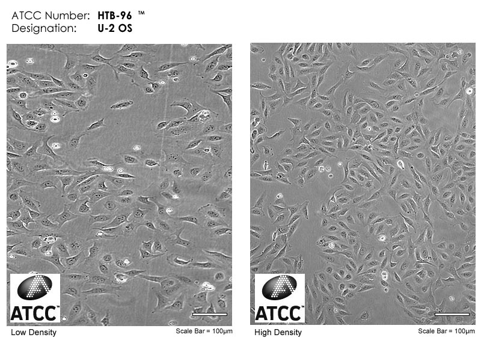
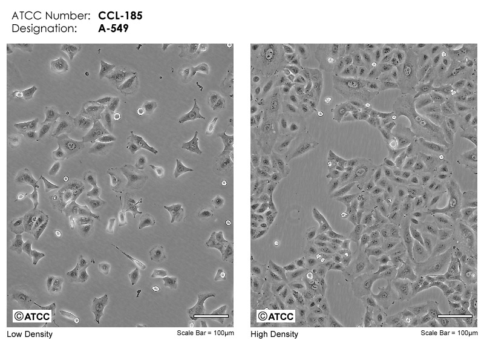

# Cell lines

아래의 목록에서 원하는 cell line을 찾아서 볼 수 있다.

Human cell lines

[HEK293T](cell-lines.md#hek293t)

[DLD-1](cell-lines.md#dld-1)

[U2-OS](cell-lines.md#u2-os)

[A-549](cell-lines.md#a-549)

Mouse cell lines

#### HEK293T

<figure><figcaption>
HEK293T, low density (좌) / high density (우)
</figcaption></figure>

<table><thead><tr><th width="175">Cagegory</th><th width="209">Feature</th><th>Cagegory</th><th>Feature</th></tr></thead><tbody><tr><td>Organism</td><td>Human, Homo sapiens</td><td>Culture media</td><td>DMEM</td></tr><tr><td>Cell type</td><td>Epithelial cell</td><td>Ploidy</td><td>3n</td></tr><tr><td>Tissue</td><td>Embryonic kidney</td><td>Puromycin</td><td>1ug/mL</td></tr><tr><td>Culture type</td><td>Adherent</td><td>Blasticidin S</td><td>10ug/mL</td></tr><tr><td>Seeding density</td><td>6x10⁴ cells / cm²</td><td>Transduction</td><td>+++</td></tr><tr><td>Doubling time</td><td>~24hr</td><td>Transfection</td><td>+++</td></tr></tbody></table>

HEK293T cell line은 transfection / transduction에 특화된 세포이기 때문에 다양한 연구에서 아주 광범위하게 활용되는 세포주이다. 특정 단백질 발현의 영향을 보려고 할 때는 간단히 plasmid vector를 transfection 해주면 되고, lentivirus를 제작하고 싶을 때도 HEK293T cell을 사용한다 ([protocol 1](https://www.addgene.org/protocols/lentivirus-production/)). 또한 배양하는 난이도도 높지 않고, 자라는 속도도 아주 빠르기 때문에 연구용으로 아주 적합한 세포이다. 한 가지 주의할 점은, 바닥에 붙어있는 힘이 아주 센 편은 아니기 때문에 dish에 조금 충격이 가해지거나 PBS wash 등에서 힘 조절을 잘못할 경우 세포들이 다 떨어져 버릴 수 있다.&#x20;

흔히 잘못 알려진 내용 중 하나가 HEK293T cell이 cancer cell line이라는 것인데, 사실이 아니다. HEK293T cell은 HEK293 cell line의 변형된 버전이며, 낙태 된 태아의 신장 세포 (human embryonic kidney cell)에서 유래했다. 따라서 cancer와는 전혀 관련이 없는 세포이다.&#x20;

대체로 transfection 효율이 아주 높은 cell line이지만, 세포의 상태에 따라서 효율이 많이 차이날 수 있다. 따라서 transfection이 기대에 못 미치는 경우, 다른 batch의 HEK293T cell line을 새로 풀어서 시도해보는 것을 추천한다.&#x20;

#### DLD-1

<figure><figcaption>
DLD-1, low density (좌) / high density (우)
</figcaption></figure>

<table><thead><tr><th width="183">Category</th><th width="223">Feature</th><th width="178">Category</th><th>Feature</th></tr></thead><tbody><tr><td>Organism</td><td>Human, Homo sapiens</td><td>Culture media</td><td>DMEM</td></tr><tr><td>Cell type</td><td>Epithelial cell</td><td>Ploidy</td><td>2n</td></tr><tr><td>Tissue</td><td>Colon</td><td>Puromycin</td><td>2ug/mL</td></tr><tr><td>Culture type</td><td>Adherent</td><td>Blasticidin S</td><td>10ug/mL</td></tr><tr><td>Seeding density</td><td>5x10⁴ cells / cm²</td><td>Transduction</td><td>++</td></tr><tr><td>Doubling time</td><td>~24hr</td><td>Transfection</td><td>?</td></tr></tbody></table>

DLD-1은 키우기 굉장히 수월한 세포이다. 아주 빽빽하게 자라도 금방 죽지 않고 잘 버티는 편이며, 4-5일에 한  번씩 subculture를 넘겨줘도 큰 문제가 없는 튼튼한 세포주이다. 또한, lentivirus transduction도 상대적으로 잘 되기 때문에 stable cell line을 제작하기도 좋다. 세포 배양 시 한 가지 특징적인 것은, 3-5일 정도 지속해서 바닥에 붙은 채로 배양하면 너무 단단하게 달라붙기 때문에 T/E를 처리해도 잘 떨어지지 않을 수 있다. 이럴 때에는 T/E를 2-3배 정도 많이 처리하고, 일정 시간 후에는 손으로 dish를 강하게 치면서 물리적으로 떼내야 할 수도 있다.

Culture media는 DMEM (+ 10% FBS)으로 사용해도 문제 없었다. ATCC 기준으로는 RPMI-1640을 추천하기도 한다.&#x20;

[DLD-1은 특히 MSH6 유전자가 knock-out 되어있는 세포](https://www.spandidos-publications.com/ijo/24/3/697)이다. 따라서 mismatch repair pathway에 관련된 연구에 많이 사용되고 있다. 또한, MMR pathway가 억제되면 prime editing에 굉장히 유리하므로, 다른 cell line보다 PE efficiency가 높은 편이다.

#### U2-OS

<figure><figcaption>
U2-OS, low density (좌) / high density (우) from <a href="https://www.atcc.org/products/htb-96">ATCC</a>
</figcaption></figure>

| Category        | Feature              | Category      | Feature |
| --------------- | -------------------- | ------------- | ------- |
| Organism        | Human, Homo sapiens  | Culture media | DMEM    |
| Cell type       | Epithelial cell      | Ploidy        | 3n      |
| Tissue          | Bone                 | Puromycin     |         |
| Culture type    | Adherent             | Blasticidin S | 10ug/mL |
| Seeding density | 2\~3x10⁴ cells / cm² | Transduction  | -       |
| Doubling time   | \~30hr               | Transfection  | ---     |

U2-OS는 세포의 크기가 큰 편이다. 따라서 cell density를 낮게 깔아줘야 한다. 또한 media의 pH 지시약 색이 크게 변하지 않았더라도, 2-3일에 한번씩 subculture를 넘겨주지 않으면 growth rate이 급격히 낮아지거나 cell이 죽어갈 수 있으므로 배양에 주의가 필요하다.&#x20;

U2-OS는 transfection / transduction의 효율이 낮은 편에 속한다. 따라서 transfection은 high-throughput 실험에 적용하기에 적절하지 않고, transduction을 할 때에는 HEK293T cell 대비 5\~10배 효율이 떨어지는 것을 감안하고 실험해야 한다.&#x20;

#### A-549

<figure><figcaption>
A-549, low density (좌) / high density (우) from <a href="https://www.atcc.org/products/ccl-185">ATCC</a>
</figcaption></figure>

<table><thead><tr><th width="180">Category</th><th width="224">Feature</th><th>Category</th><th>Feature</th></tr></thead><tbody><tr><td>Organism</td><td>Human, Homo sapiens</td><td>culture media</td><td>DMEM</td></tr><tr><td>Cell type</td><td>Epithelial cell</td><td>Ploidy</td><td>3n</td></tr><tr><td>Tissue</td><td>Lung</td><td>Puromycin</td><td>1ug/mL</td></tr><tr><td>Culture type</td><td>Adherent</td><td>Blasticidin S</td><td>10ug/mL</td></tr><tr><td>Seeding density</td><td>2~3x10⁴ cells / cm²</td><td>Transduction</td><td>+</td></tr><tr><td>Doubling time</td><td>30~40hr</td><td>Transfection</td><td>---</td></tr></tbody></table>

ATCC에서 추천하는 media는 F12지만, DMEM으로도 문제 없이 배양할 수 있다.&#x20;

검색해서 찾아봤을 때에는 doubling time이 22\~24hr 정도라고 나왔으나, 우리 실험실에서 다뤄봤을 때에는 자라는 속도가 상대적으로 느린 편이다. 형태는 각진 다각형이다. 오밀조밀 빽빽하게 자라나는 것이 특징이다. 단, 일정 수준 이상 cell이 차게  되면 자라는 속도가 급격하게 느려진다.&#x20;

실험상 특이점은 cell pellet 크기에 비해 gDNA 추출 수율이 낮다는 것이다. 아마도 cell 사이즈가 크기 때문으로 보인다.&#x20;

