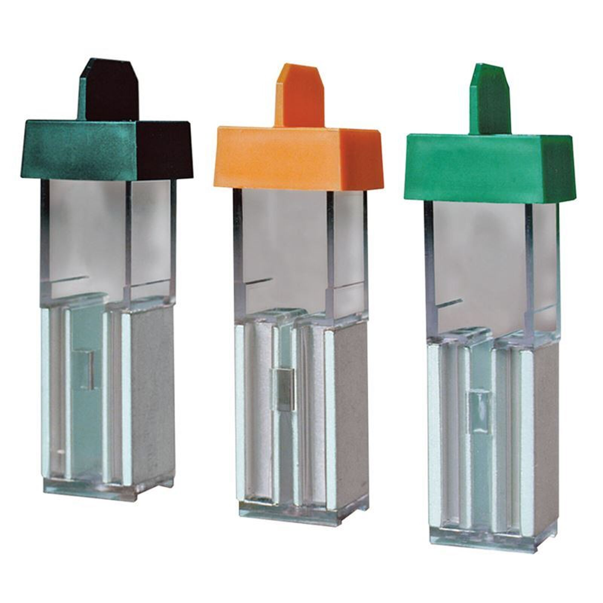

# Transfection

## Electroporation

Electroporation은 전기 충격을 이용해서 외부 전달체가 세포 내부로 들어가도록 유도하는 방법이다. 대표적으로 많이 사용되는 장비는 [Neon Transfection System](https://www.thermofisher.com/kr/ko/home/life-science/cell-culture/transfection/neon-transfection-system.html) (Thermo Fisher) 또는 [NEPA21 ](https://www.nepagene.jp/e\_products\_nepagene\_0001.html)(NEPAGENE)이다.&#x20;

### Cuvette 사용

<figure><figcaption>
Electroporation cuvettes
</figcaption></figure>

#### Case study: NEPA21 electroporation을 이용해서 세포에 RNA 전달하기

