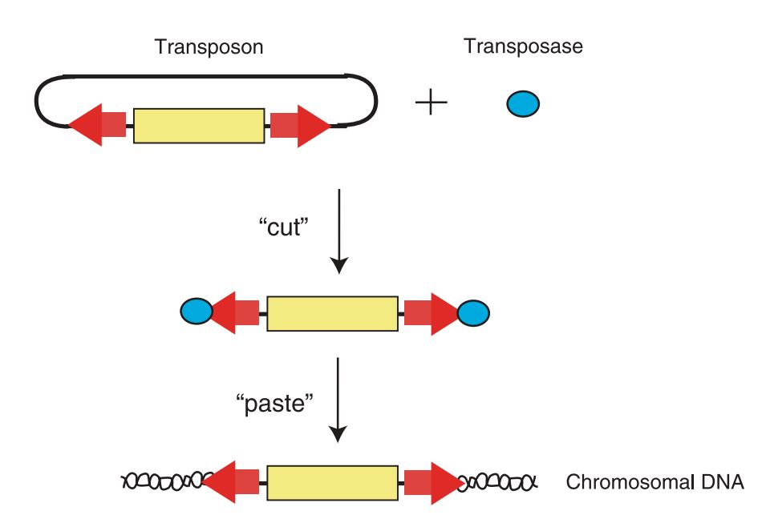

# Transposition

Transposon은 semi-random integration을 통해 원하는 유전자를 genome 상에 넣어주는 방법이다. 이렇게 넣어주는 방식을 transposition이라고 하며, transposition을 하는데 필요한 구성 요소들이 들어있는 유전자 세트를 transposon이라고 한다.&#x20;

제품화 되어 판매되는 대표적인 것은 'PiggyBac' 또는 'Sleeping Beauty' transposase이다.&#x20;

## PiggyBac transposon system

[PiggyBac transposon](https://www.sciencedirect.com/science/article/pii/S0092867405007075?via%3Dihub)은 'cut and paste' 메커니즘을 통해 vector 안의 유전자를 chromosome 안에 넣어주는 방법이다. Cut and Paste 매커니즘이란, PiggyBac vector에서 inverted terminal repeat (ITR)을 인식해서 transposase가 잘라주고, 이를 chromosomal DNA에서 TTAA sequence 위치에 붙여준다는 의미에서 붙은 이름이다.

<figure><figcaption>
<em>PiggyBac</em> transposon에서 'cut and paste' 메커니즘 (<a href="https://journals.physiology.org/doi/full/10.1152/physiolgenomics.90242.2008">Adams <em>et al.</em> 2008</a>)
</figcaption></figure>

PB transposase는 TTAA tetranucleotides를 target genome 상에서 찾아서 거의 무작위적으로 넣어준다.&#x20;
