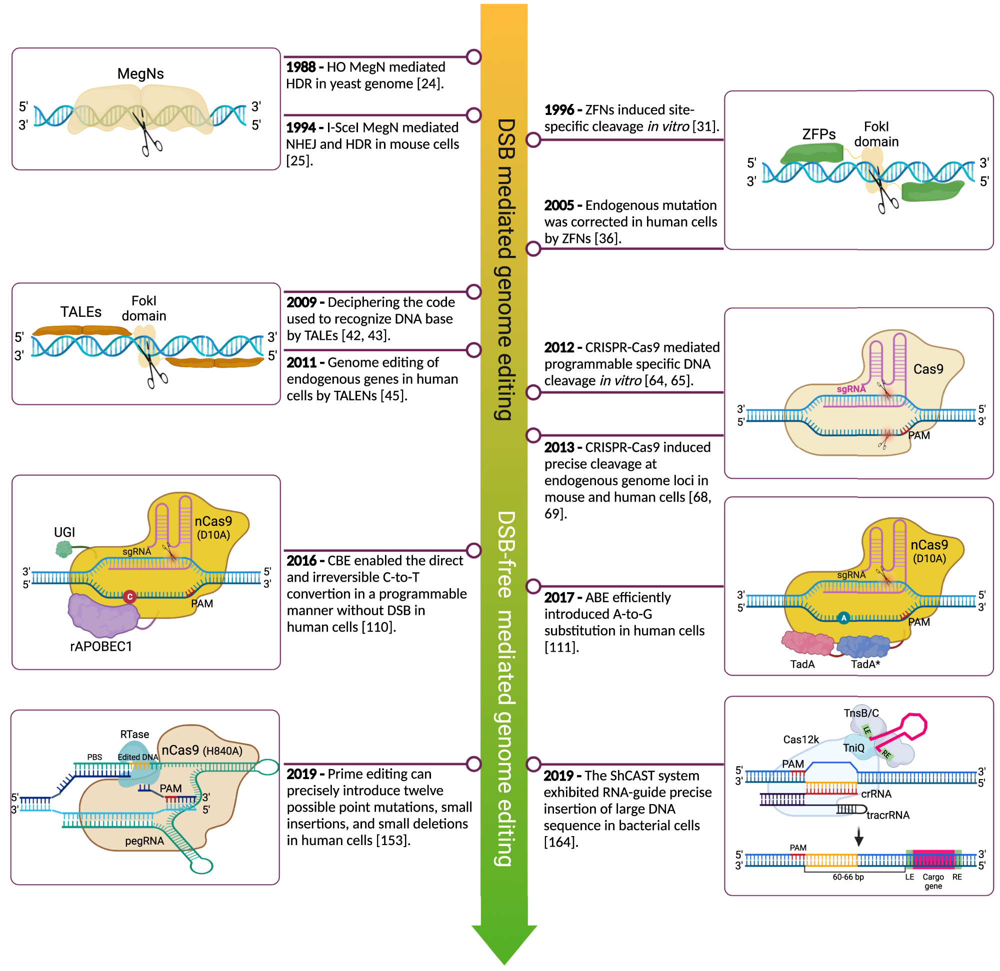
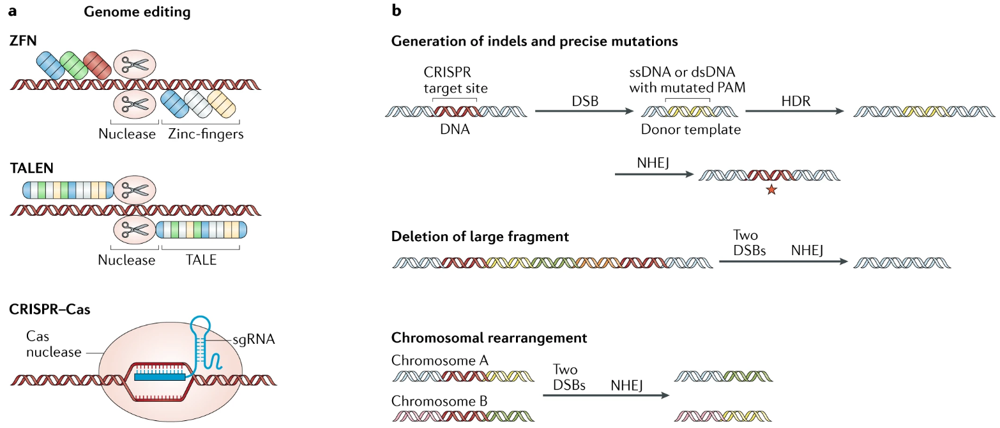

# 🧬 Genome editing

## 유전자 교정 기술과 발전 과정

유전자 교정 (Genome editing)은 원하는 유전자 서열 위치에 원하는 유전자 편집을 할 수 있는 기술이다. 초창기에 징크핑거 유전자 가위 (ZFNs)를 이용한 유전자 교정 연구가 활발하게 진행되면서, 현재는 CRISPR system을 이용한 기술이 주로 연구되고 있다.&#x20;

<figure><figcaption>
Timeline of the genome editing methods (<a href="https://doi.org/10.1515/mr-2022-0029">Huang C. et al., Med.Rev., 2022)</a>.
</figcaption></figure>

초기의 유전자 교정 기술들은 대부분 이중 가닥 절단 (double strand break; DSB)를 일으키고, 해당 위치에 원하는 유전자 교정을 유도하는 방식이었다. 하지만 DSB를 일으킬 경우, 원하지 않는 유전자의 손상이 일어날 위험성이 높기 때문에 안전성에 대한 큰 한계가 있었다.&#x20;

이후, DSB를 일으키지 않고도 유전자 교정을 할 수 있는 염기 편집기 (base editor; BE)가 개발되면서, 임상적으로 중요한 유전자 돌연변이 중 대부분의 단일 염기 변이 (SNVs)를 훨씬 안전하게 교정할 수 있는 기술을 얻게 되었다.&#x20;

최근에는 DSB를 일으키지 않고도 모든 형태의 유전자 교정 (치환, 삽입, 삭제)을 할 수 있는 기술은 프라임 에디팅 (prime editing; PE)가 개발되면서, 유전자 교정의 범위를 훨씬 확장할 수 있게 되었다.&#x20;

## 유전자 교정 기술의 종류와 원리

<figure><figcaption>
유전자 교정의 종류와 메커니즘 (<a href="https://www.nature.com/articles/s41571-019-0166-8">Yin H. et al., Nat.Rev.Clin.Oncol., 2019</a>).
</figcaption></figure>

Recomended references for genome editing

2023\. 01. 09. updated

**General reviews**

A guide to genome engineering with programmable nucleases ([Kim H. et al., Nat.Rev.Genet., 2014](https://www.nature.com/articles/nrg3686#citeas))

CRISPR–Cas: a tool for cancer research and therapeutics ([Yin H. et al., Nat.Rev.Clin.Oncol., 2019](https://www.nature.com/articles/s41571-019-0166-8)).

Genome editing with CRISPR–Cas nucleases, base editors, transposases and prime editors ([Anzalone A. V. et al., Nat.Biotechnol., 2020](https://www.nature.com/articles/s41587-020-0561-9))

**Cas9 nuclease**

SpCas9 activity prediction by DeepSpCas9, a deep learning–based model with high generalization performance ([Kim H. K., Sci.Adv., 2019](https://www.science.org/doi/10.1126/sciadv.aax9249#BIBL))

High-throughput analysis of the activities of xCas9, SpCas9-NG and SpCas9 at matched and mismatched target sequences in human cells ([Kim H. K., Nat.Biomed.Eng., 2020](https://www.nature.com/articles/s41551-019-0505-1))

Prediction of the sequence-specific cleavage activity of Cas9 variants ([Kim N., Nat.Biotechnol., 2020](https://www.nature.com/articles/s41587-020-0537-9))

**Base editing**

Base editing: precision chemistry on the genome and transcriptome of living cells ([Rees H. A., Nat.Rev.Genet., 2018](https://www.nature.com/articles/s41576-018-0059-1))

High-throughput functional evaluation of human cancer-associated mutations using base editors ([Kim Y et al., Nat.Biotechnol., 2022](https://www.nature.com/articles/s41587-022-01276-4))

**Prime editing**

Search-and-replace genome editing without double-strand breaks or donor DNA ([Anzalone A. V. et al., Nature, 2019](https://www.nature.com/articles/s41586-019-1711-4))

Predicting the efficiency of prime editing guide RNAs in human cells ([Kim H. K., Nat.Biotechnol., 2020](https://www.nature.com/articles/s41587-020-0677-y))

Enhanced prime editing systems by manipulating cellular determinants of editing outcomes ([Chen P. J. et al., Cell, 2021](https://www.sciencedirect.com/science/article/pii/S0092867421010655))

Prime editing for precise and highly versatile genome manipulation ([Chen P. J. et al., Nat.Rev.Genet., 2022](https://www.nature.com/articles/s41576-022-00541-1))

