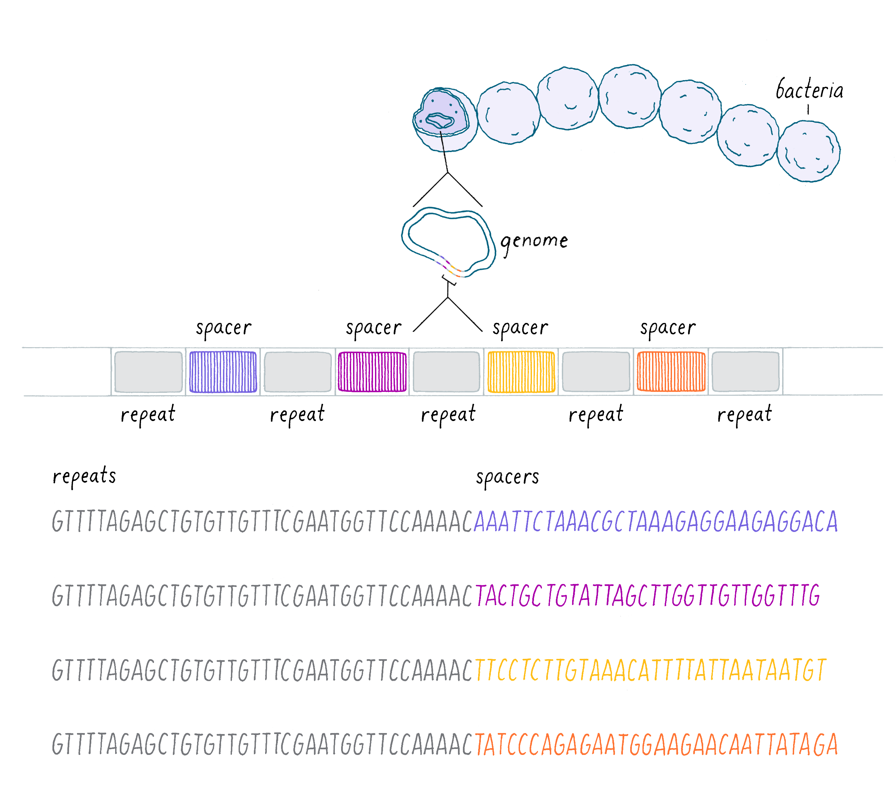
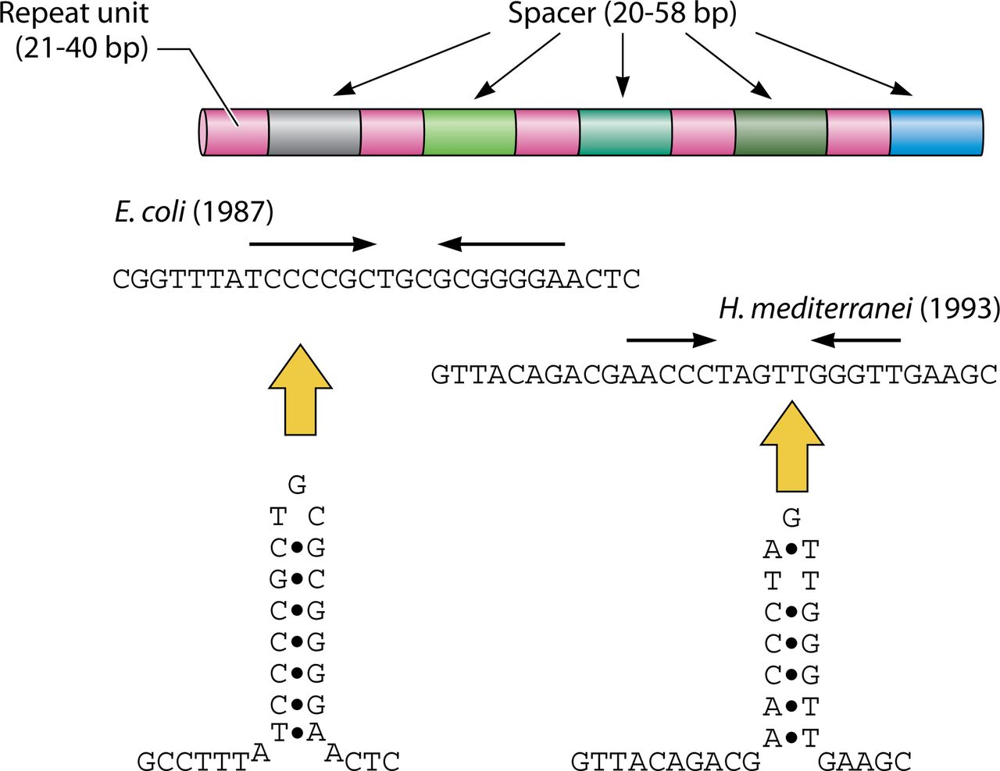
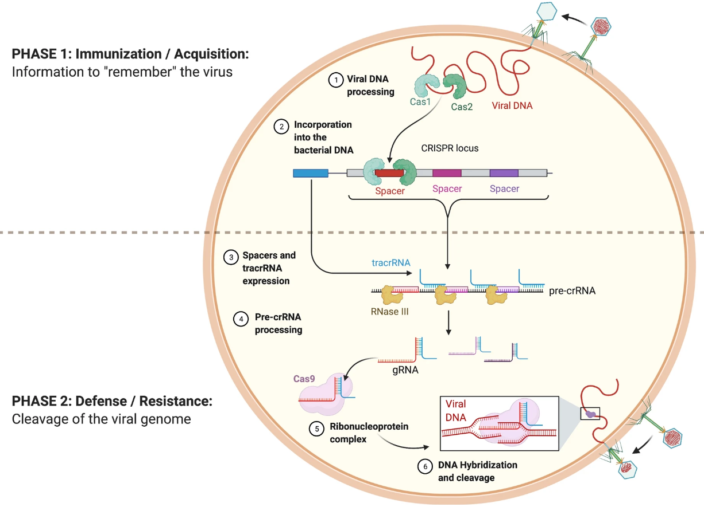
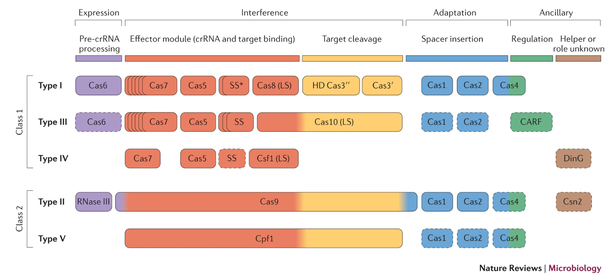

# CRISPR-Cas system

## CRISPR의 발견

<figure><figcaption>
The CRISPR array in the genome of bacteria (<a href="https://explorebiology.org/collections/genetics/crispr-cas:-from-bacterial-adaptive-immunity-to-a-genome-editing-revolution">Barrangou R., XBio</a>).
</figcaption></figure>

Bacteria의 유전자를 전문적으로 연구하던 과학자들은 아주 이상한 구조의 서열을 발견한다. 특정 서열이 반복 (repeat) 되고, 사이사이마다 특정 간격의 서열 (spacer)이 반복되는 구조이다. 지금까지 기능을 알 수 없던 유전자들은 많았으나, 이렇게 규칙적으로 반복되는 서열이 명확하게 존재하는 경우는 흔치 않았다. 심지어 특정 박테리아 종에서만 발견되는 것이 아니라, 수 많은 종에서 유사한 구조들이 발견된다는 보고들이 발표되었다.

<figure><figcaption>
회문 구조를 이루는 반복 서열 (<a href="https://journals.asm.org/doi/10.1128/JB.00580-17">Ishino Y et al., J.Bacteriol., 2018</a>).
</figcaption></figure>

그리고 또 특이적인 것은, 반복 서열 (repeat)이 앞뒤로 상보적인 형태를 이루는 [회문 구조](#user-content-fn-1)[^1] (palindromic sequence)를 이룬다는 것이다. 마치 위 그림처럼 반으로 접혀서 서로 달라붙을 수 있도록 이루어졌다.

당시 연구자들은 기능은 몰랐으나, 일단 이런 구조를 지칭할 이름이 필요했으므로 '주기적 간격으로 분포하고 짧은 회문 구조 반복의 군집 (Clusters of Regularly InterSpaced Palindromic Repeats; CRISPR)'이라고 이름 붙였다.&#x20;

## 박테리아의 면역 체계

<figure><figcaption>
CRISPR-Cas9 Adaptive Immune System of <em>Streptococcus pyogenes</em> Against Bacteriophages (<a href="https://app.biorender.com/biorender-templates">BioRender.com, 2021</a>)
</figcaption></figure>

## 유전자 가위의 개발

## CRISPR-Cas system의 분류와 체계

<figure><figcaption>
Functional classification of Cas proteins (<a href="https://www.nature.com/articles/nrmicro3569">Makarova K. S. et al., Nat.Rev.Microbiol., 2015</a>).
</figcaption></figure>

Recomended references

_CRISPR-Cas system의 분류와 체계에 대한 연구에서 대표적인 논문들 (updated 23.01.09.)_

An updated evolutionary classification of CRISPR–Cas systems ([Makarova K. S. et al., Nat.Rev.Microbiol., 2015](https://www.nature.com/articles/nrmicro3569))

Evolutionary classification of CRISPR–Cas systems: a burst of class 2 and derived variants ([Makarova K. S. et al., Nat.Rev.Microbiol., 2019](https://www.nature.com/articles/s41579-019-0299-x))

[^1]: DNA 염기서열이 역순으로 배치돼 앞뒤 어느 방향으로 읽어도 똑같이 읽히는 구조
