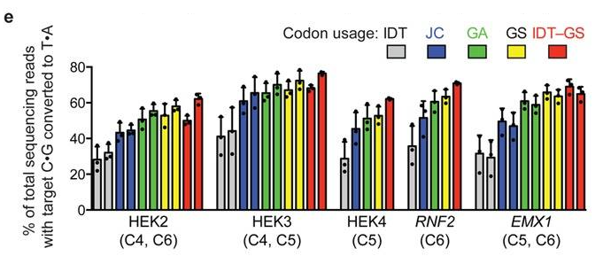
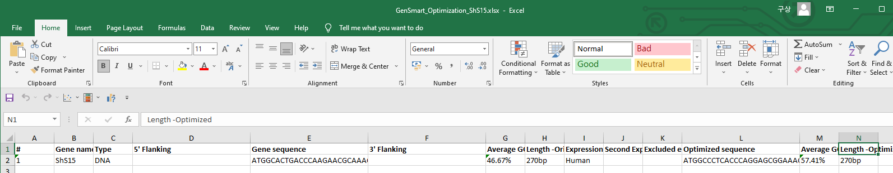

# Codon optimization

동일한 아미노산을 암호화하는 염기서열 (codon)은 적게는 1개부터 많게는 6개까지 존재한다. 어떤 것을 사용해도 결과적으로 동일한 기능을 하는 단백질이 만들어지지만, 발현하는 세포의 종류에 따라서 발현 과정에서 선호하는 codon들이 다르다. 따라서 박테리아의 단백질을 인간 세포에서 발현하고 싶을 때 CDS sequence를 그대로 가져와서 프로모터 뒤에 넣어주면, 기대했던 것보다 낮은 단백질 발현 때문에 원하는 결과를 얻지 못할 수도 있다.&#x20;

## Codon usage

<figure><figcaption>
The codon content of an mRNA can influence translation via tRNA-dependent mechanisms. (<a href="https://doi.org/10.1038/nrm.2017.91">Hanson, G., Coller, J. <em>Nat Rev Mol Cell Biol, 2018</em></a>)
</figcaption></figure>

모든 종들은 codon usage가 다르다. 같은 Phe를 달고 있는 tRNA에 대해서도 어떤 종은 TTT가 훨씬 많이 있을 수 있고, 다른 종은 TTC가 많이 있을 수 있다. 각 종마다 각 아미노산에 대해서 [어떤 codon이 많이 사용되는지](https://www.genscript.com/tools/codon-frequency-table)도 많이 연구가 되어있다. tRNA 분포 뿐만 아니라 codon context에 따라서 mRNA의 안정성도 다를 수 있다.

## Codon optimization

연구자들은 각 종류의 세포에서 codon preference 패턴을 찾아내는 연구를 통해 어떤 동일한 아미노산 서열에 대해서도 각 세포마다 발현양을 극대화시킬 수 있는 요소들을 찾아냈다. 이를 기반으로 현재 우리는 새로운 서열에 대해서도 원하는 세포에서의 최적화된 코돈 서열을 손쉽게 추천 받을 수 있다.

유명한 예시로, base editor (bis-bpNLS-BE4)의 codon을 다양한 optimization 알고리즘으로 최적화한 서열을 각각 비교했을 때, editing efficiency에 큰 차이가 있다는 결과가 보고된 바 있다 ([2018, Koblan, L. _et al., NatBiotechnol_](https://www.nature.com/articles/nbt.4172))&#x20;

<figure><figcaption>
Effects of five codon usages on editing efficiency of bis-bpNLS-BE4 in HEK293T cells. IDT=Integrated DNA Technologies; JC=Jeff Coller; GA=GeneArt; GS=GenScript; IDT-GS=IDT APOBEC+GenScript Cas9 nickase. (<strong>f</strong>) Phylogenetic tree for ancestral APOBEC reconstruction.
</figcaption></figure>

알고리즘마다 차이가 있고, 최근에는 머신러닝을 도입해서 알고리즘이 계속 발전하는 중이다.&#x20;

## GenSmart

대표적으로 많이 사용되는 것 중 하나는, GenScript 사에서 제작한 ['GenSmart Optimization'](https://www.genscript.com/tools/gensmart-codon-optimization)이다. GenSmart Optimization은 최적화 된 코돈 서열을 무료로 제안해주는 프로그램으로, 가장 많이 사용되는 optimization tool 중 하나이다.

<figure><figcaption>
GetSmart 사용 화면.
</figcaption></figure>

Codon optimization을 하고 싶은 서열을 입력하고 host organism을 선택하면, 그에 맞는 최적의 sequence를 알려준다. 위 예시는 _Scytonema hofmanni_ 의 codon을 human에 최적화하도록 요청한 것이다.&#x20;

<figure><figcaption>
Optimize를 클릭해서 진행 중인 화면.
</figcaption></figure>

필요한 정보들을 입력하고 'Optimize' 버튼을 클릭하면, 작업이 진행된다. 작업 시간은 입력한 서열의 길이에 따라서 크게 좌우된다. 서열이 길어질수록 시간이 기하급수적으로 증가한다. 수 백bp 수준의 서열의 경우에는 1시간 내외로 끝날 수 있으나, 수 천 bp 수준의 경우에는 수 십 시간 이상 걸릴 수 있다. 작업이 완료되면 메일로 알림이 오니, 오래 걸리는 작업은 여유를 가지고 기다리면 된다.&#x20;

<figure><figcaption>
GenSmart 결과 파일
</figcaption></figure>

작업이 끝나면 optimized sequence 정보가 담긴 파일을 다운로드 받을 수 있다. 이제 이 서열을 원하는 연구에 사용하면 된다.
