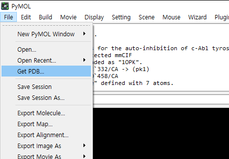
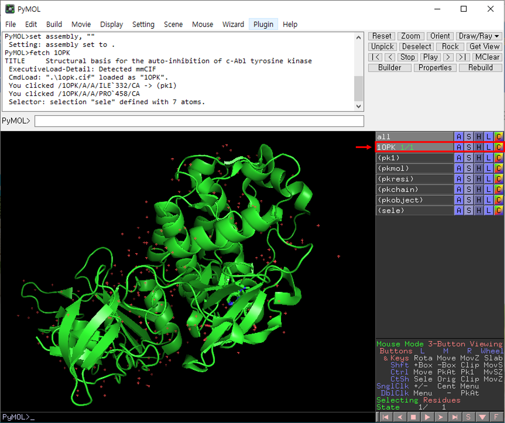

# PyMol

Pymol은 Warren L. DeLano에 의해 개발된 단백질 구조 시각화 프로그램이다. 현재는 [schrodinger](https://github.com/schrodinger) 의해서 개발되고 서비스 되고 있다. 모든 기능을 사용하기 위해서는 라이센스를 구매해야 하지만, 무료인open-source 버전도 있기 때문에 간단한 분석을 할 때에는 무료 버전을 사용해도 충분하다.&#x20;

### PyMol open-source version 설치하기

#### 1) ubuntu 계열 (apt 설치)

```
sudo apt update
sudo apt install pymol
```

#### 2) conda를 이용한 설치

conda를 이용하면 훨씬 간편하게 설치할 수 있다 ([참고](https://omicx.cc/posts/2021-04-20-install-pymol-windows/)).

```
conda create -n pymol
conda activate pymol
conda install -c conda-forge pymol-open-source
```

설치 후, 명령어 창에 pymol 을 입력하면 프로그램이 실행된다.&#x20;


### Pymol을 이용한 단백질 구조 시각화

먼저 원하는 단백질의 구조 파일을 가져온다. 대표적으로 PDB에서 가져오면 된다. 파일을 다운로드 받아서 Open으로 열거나, Get PDB를 이용해서 불러올 수 있다. 저는  Get PDB를 이용해서 '1OPK' 단백질 구조를  불러오겠습니다.&#x20;

<figure><figcaption><p>PyMol의 첫 화면. PDB 파일을 불러올 수 있다.</p></figcaption></figure>

불러온 PDB 파일은 화면에 3D 구조로 나타납니다. 이 화면을 마우스 좌클릭 한 상태에서 움직이면 원하는 방향으로 자유롭게 회전시킬 수 있습니다. Control을 누른 상태로 마우스 휠을 돌리면 zoom in/out을 할 수 있습니다.&#x20;


오른쪽 패널에는 각종 기능을 선택할 수 있는 버튼들이 있습니다.  여기서 1OPK 옆의 A 버튼 (Action)을 누릅니다.

<figure><figcaption></figcaption></figure>


