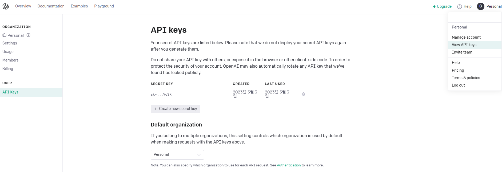
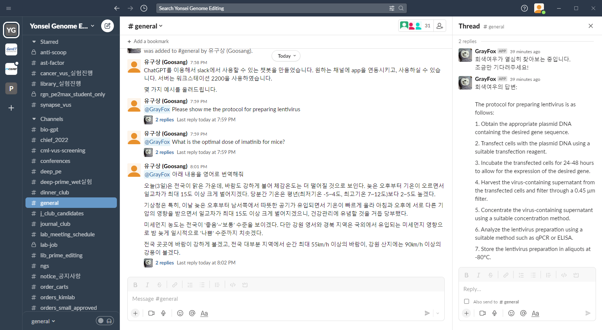

# 😎 App

[참고자료 1](https://yunwoong.tistory.com/129?category=922179): Python으로 Slack App(Bot) 만들기

[참고자료 2](https://jaeyung1001.tistory.com/entry/Slack-ChatGPT-Slack-%EC%B1%97%EB%B4%87-%EB%A7%8C%EB%93%A4%EA%B8%B0-2%ED%8E%B8): \[Slack] ChatGPT Slack 챗봇 만들기 (2편)

[참고자료 3](https://manchann.tistory.com/43): Slack ChatGPT 연동하기


본 내용은 [Alexandre t'Kint의 글](https://medium.com/@alexandre.tkint/integrate-openais-chatgpt-within-slack-a-step-by-step-approach-bea43400d311)을 참고하여 구현한 내용을 정리한 것입니다.&#x20;

## Step1: Slack에 app을 등록하고, token 생성하기

Slack에 ChatGPT를 연동하기 위해서, 우리는 Slack에 챗봇 app을 만들고, 그 app에 ChatGPT를 사용하는 기능을 넣어주겠습니다.&#x20;

Bot 기능을 가지는 app을 만들 것이기 때문에, 우리는 Slack Bot Token과 Slack App Token을 각각 얻어서 등록해야 합니다.&#x20;

1. Slack workspace에 로그인다.
2. [Slack API website](https://api.slack.com/)에 들어간다.&#x20;
3. 'Create an app'을 눌러서 'From scratch'를 클릭한다.&#x20;

<figure><figcaption><p>Create New App을 눌렀을 때 나타나는 화면.</p></figcaption></figure>

4. App 이름을 정하고, 설치할 Slack workspace를 선택합니다. 이제부터 챗봇에 필요한 각종 설정들을 등록한다.
5. 'Basic information > Add features and functionality에서, 'Permissions'를 선택해서 들어갑니다. 그리고 Scopes add in Bot Token Scopes에서 `app_mentions:read`, `channels: history`, `channels:read`, `chat:write`를 등록해준다.&#x20;
6. Settings > Socket Mode에 들어가서, socket mode를 활성화한다.

<figure><figcaption><p>Socket Mode 활성화</p></figcaption></figure>

7. Basic information > 'App-Level Tokens'에서 'Generate Token and Scopes'를 클릭해서 Token을 생성합니다. 그리고 생성된T Slack Bot App Token ('xapp'으로 시작하는 문자열)을 복사한다.&#x20;

<figure><figcaption><p>App token을 생성하기.</p></figcaption></figure>

8. Basic information > 'Add features and functionality' > 'Event Subscriptions'에 들어가서 이 기능을 활성화하고, 'Subscribe to bot events'에서는 'app\_mention'을 선택하고 저장한다.

<figure><figcaption><p>Event Subscriptions 기능 활성화</p></figcaption></figure>

9. 'OAuth & Permissions'에서, Install to Workspace를 눌러서 Slack에 App을 설치한다.&#x20;
10. Slack Bot Token을 복사한다 ('xoxb'로 시작하는 문자열)

## Step2: OpenAI API key 생성하기

다음으로, ChatGPT API를 제공하는 'OpenAI'의 API key를 생성하는 단계이다.&#x20;

1. [OpenAI API website](https://openai.com/blog/openai-api)에 접속해서 회원가입 후, 로그인한다.
2. API Key 탭으로 들어가서 'Create new secret key'를 눌러서 새 API key를 만든다.

<figure><figcaption><p>OpenAI API key</p></figcaption></figure>

3. OpenAI API key를 복사한다.

## Step3: 필수 패키지 설치

다음으로, python으로 slack과 openai를 app으로 연동하기 위한 필수 패키지들을 설치한다. 특히 'Slack-Bolt' 패키지는 Slack app을 손 쉽게 만들 수 있는 함수들을 제공한다. 가상환경을 만들고, 아래의 패키지들을 설치한다.

```
pip install openai
pip install slack-bolt
pip install slack_sdk
```

## Step4: Application 실행

위에서 생성한 token들을 이용해서 app을 만드는 과정이다. Python script를 아래와 같이 작성한다.&#x20;

```python
SLACK_BOT_TOKEN = "위에서 얻은 Slack Bot Token을 넣으세요."
SLACK_APP_TOKEN = "위에서 얻은 Slack App Token을 넣으세요."
OPENAI_API_KEY  = "위에서 얻은 OpenAI API Token을 넣으세요."

import os
import openai
from slack_bolt.adapter.socket_mode import SocketModeHandler
from slack_sdk import WebClient
from slack_bolt import App

# Event API & Web API
app = App(token=SLACK_BOT_TOKEN) 
client = WebClient(SLACK_BOT_TOKEN)

# This gets activated when the bot is tagged in a channel    
@app.event("app_mention")
def handle_message_events(body, logger):
    # Log message
    print(str(body["event"]["text"]).split(">")[1])
    
    # Create prompt for ChatGPT
    prompt = str(body["event"]["text"]).split(">")[1]
    
    # Let thre user know that we are busy with the request 
    response = client.chat_postMessage(channel=body["event"]["channel"], 
                                       thread_ts=body["event"]["event_ts"],
                                       text=f"회색여우가 열심히 찾아보는 중입니다. \n조금만 기다려주세요!")
    
    # Check ChatGPT
    openai.api_key = OPENAI_API_KEY
    response = openai.Completion.create(
        engine="text-davinci-003",
        prompt=prompt,
        max_tokens=1024,
        n=1,
        stop=None,
        temperature=0.5).choices[0].text
    
    
    # Reply to thread 
    response = client.chat_postMessage(channel=body["event"]["channel"], 
                                       thread_ts=body["event"]["event_ts"],
                                       text=f"회색여우의 답변: \n{response}")

if __name__ == "__main__":
    SocketModeHandler(app, SLACK_APP_TOKEN).start()
```

일반적인 방식으로 실행한다면, 아래의 명령어를 터미널에 입력한다.&#x20;

```
python app.py
```

실행 후 터미널에 “⚡️ Bolt app is running!”라고 나타나면, 성공적으로 app이 실행된 것이다.&#x20;

이를 백그라운드에서 실행하고  싶다면, nohup을 사용해 실행한다.

```
$ nohup python app.py&
```

이제 slack에서 원하는 채널에 app을 불러오고, 챗봇 이름을 언급해서 불러온 후 내용을 입력하면 thread로 답변이 달린다.&#x20;

<figure><figcaption></figcaption></figure>

