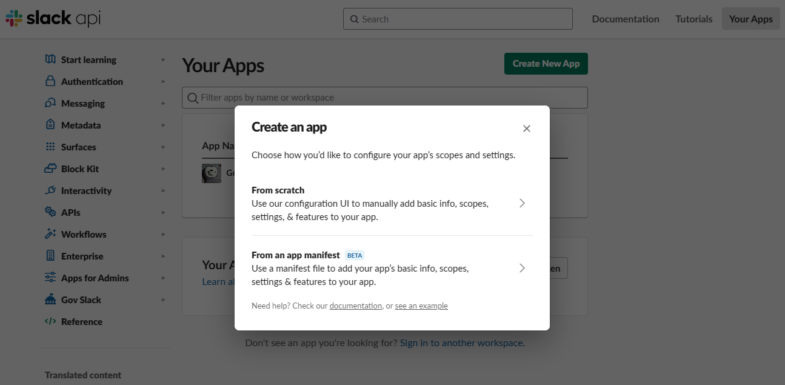
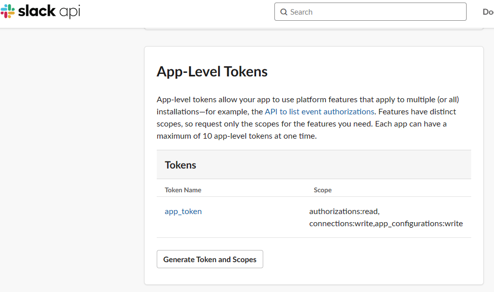

# 😎 App

[참고자료 1](https://yunwoong.tistory.com/129?category=922179): Python으로 Slack App(Bot) 만들기

[참고자료 2](https://jaeyung1001.tistory.com/entry/Slack-ChatGPT-Slack-%EC%B1%97%EB%B4%87-%EB%A7%8C%EB%93%A4%EA%B8%B0-2%ED%8E%B8): \[Slack] ChatGPT Slack 챗봇 만들기 (2편)

[참고자료 3](https://manchann.tistory.com/43): Slack ChatGPT 연동하기

본 내용은 [Alexandre t'Kint의 글](https://medium.com/@alexandre.tkint/integrate-openais-chatgpt-within-slack-a-step-by-step-approach-bea43400d311)을 참고하여 구현한 내용을 정리한 것입니다.&#x20;

## Step1: Slack에 app을 등록하고, token 생성하기

Slack에 ChatGPT를 연동하기 위해서, 우리는 Slack에 챗봇 app을 만들고, 그 app에 ChatGPT를 사용하는 기능을 넣어주겠습니다.&#x20;

Bot 기능을 가지는 app을 만들 것이기 때문에, 우리는 Slack Bot Token과 Slack App Token을 각각 얻어서 등록해야 합니다.&#x20;

1. Slack workspace에 로그인다.
2. [Slack API website](https://api.slack.com/)에 들어간다.&#x20;
3. 'Create an app'을 눌러서 'From scratch'를 클릭한다.&#x20;

<figure><figcaption>
Create New App을 눌렀을 때 나타나는 화면.
</figcaption></figure>

4. App 이름을 정하고, 설치할 Slack workspace를 선택합니다. 이제부터 챗봇에 필요한 각종 설정들을 등록한다.
5. 'Basic information > Add features and functionality에서, 'Permissions'를 선택해서 들어갑니다. 그리고 Scopes add in Bot Token Scopes에서 `app_mentions:read`, `channels: history`, `channels:read`, `chat:write`를 등록해준다.&#x20;
6. Settings > Socket Mode에 들어가서, socket mode를 활성화한다.

<figure><figcaption>
Socket Mode 활성화
</figcaption></figure>

7. Basic information > 'App-Level Tokens'에서 'Generate Token and Scopes'를 클릭해서 Token을 생성합니다. 그리고 생성된T Slack Bot App Token ('xapp'으로 시작하는 문자열)을 복사한다.&#x20;

<figure><figcaption>
App token을 생성하기.
</figcaption></figure>

8. Basic information > 'Add features and functionality' > 'Event Subscriptions'에 들어가서 이 기능을 활성화하고, 'Subscribe to bot events'에서는 'app\_mention'을 선택하고 저장한다.

<figure><figcaption>
Event Subscriptions 기능 활성화
</figcaption></figure>

9. 'OAuth & Permissions'에서, Install to Workspace를 눌러서 Slack에 App을 설치한다.&#x20;
10. Slack Bot Token을 복사한다 ('xoxb'로 시작하는 문자열)

## Open AAI

