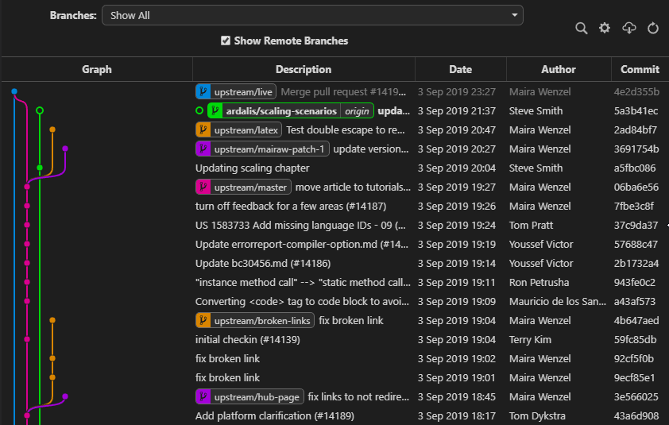
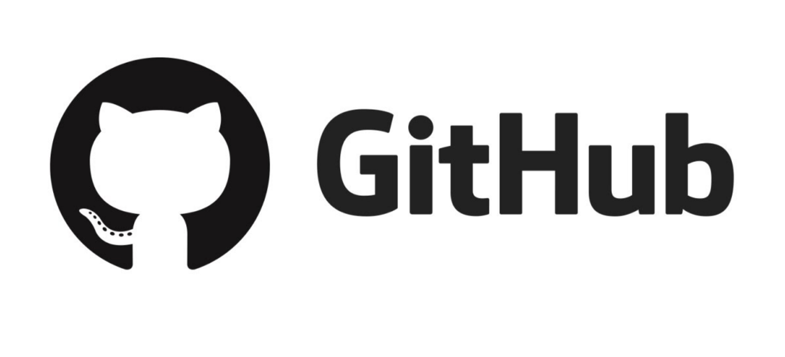

# Git / Github

## Git: 소스코드 버전 관리 시스템

<figure><figcaption></figcaption></figure>

코드를 작성하다 보면 다양한 버전의 코드를 관리해야 하는 경우가 많다. 개발을 진행하면서 점점 수정되는 버전들이 있거나, 다른 사람들과 협업하면서 서로 다른 부분에 대한 코딩을 하는 경우에 이를 통합 관리해줘야 한다. Git은 이러한 소스코드 파일들의 변경 사항을 추적하고, 여러 사용자들 간의 작업을 통합해서 관리해주는 시스템이다.&#x20;

코딩 작업을 많이 하게 된다면, git을 이용한 버전 관리는 필수이다. 코드를 수정하면서 사용하다가 갑자기 예전의 코드의 일부가 필요하게 될 수도 있기 때문이다. 또한 자신의 개발 과정이 어떻게 진행되어왔고, 어떤 부분이 수정되어 왔는지 기록하는 용도로도 중요한 역할을 한다.&#x20;

### Branch: 특정 작업을 위한 별도의 버전

<figure><figcaption>
Git Graph를 이용해 볼 수 있는 소스코드 버전 개발 현황
</figcaption></figure>

### Git 명령어

Git을 사용하는 방법은 터미널에 git 명령어를 사용해서 소스코드 파일을 자신의 저장소에 보내거나 (push) 불러오는 (pull) 방식이다. Push와 pull 등 생소한 개념을 나타내는 용어들이 몇 가지 있는데, git을 이용하기 위해서는 꼭 알아둬야 할 내용들이니 개념을 자세히 찾아보길 바란다.

아래는 git에서 사용하는 기본적이고 대표적인 용어들이다.

<table><thead><tr><th width="154">명칭</th><th>설명</th></tr></thead><tbody><tr><td>status</td><td>
현재 버전 관리 대상인 파일들의 상태를 의미한다. 

<strong>Tracked:</strong> 커밋 된 파일, 스테이지에 있는 파일을 의미한다. 해당 파일이 수정되었고 git으로 새로운 버전으로 인식되어 추적 된 파일임을 나타낸다. 커밋 되거나 스테이지에 있는 파일이라는 것은 곧 새 버전으로 저장소에 올릴 예정임을 나타낸다. 

<strong>Untracked:</strong> 그 외에 다른 파일들을 나타낸다. 기존 파일 중 수정 사항이 없거나, git의 추적에서 제외한 파일 리스트(.gitignore)에 등록된 파일들이 해당한다.
</td></tr><tr><td>add</td><td>
수정된 파일들을 commit하기 위한 등록을 하는 과정이다. 

스테이징 (staging)이라고 표현하기도 한다.
</td></tr><tr><td>commit</td><td>
Stage에 올린 파일들의 변경 이력을 등록하는 과정이다. Commit을 하는 순간 영문/숫자로 이루어진 40자리의 고유한 ID가 부여된다. 저장소에서는 이 ID를 보고 각 commit을 구분하고 선택한다. 

모든 commit은 각각 함께 등록되는 메세지가 포함되어야 한다. 주로 commit 내의 변경 내용을 요약한 내용을 작성한다.
</td></tr><tr><td>push</td><td>등록된 변경 이력 (commit)을 원격 저장소에 공유하는 과정이다. Upload 또는 Sync 라고도 표현하는 경우도 있다.</td></tr><tr><td>fetch</td><td></td></tr><tr><td>pull</td><td></td></tr><tr><td>merge</td><td></td></tr><tr><td>checkout</td><td></td></tr></tbody></table>


위 표에서 명칭은 각 기능에 대한 용어를 나타내기도 하면서 동시에 git 시스템을 실행하는 명령어로 사용되기도 한다. 예를 들어, commit 이라는 명칭은 실제로 git 명령어로 아래와 같이 사용된다.&#x20;

`$ git commit -m "커밋 메시지"`


## Github: 소스코드 저장소

<figure><figcaption>
Github의 캐릭터 이름은 옥토캣 (Octocat)이다. 귀여운 얼굴에 그렇지 못한 신체를 가지고 있다...
</figcaption></figure>

Git을 사용해서 추적 / 관리하는 소스코드들은 별도의 저장소에 저장되어야 나중에 필요할 때 불러오거나 최신 코드들과 비교해볼 수 있다. 깃허브 (GitHub)는 git으로 관리되는 소스코드를 원격으로 연결해서 해당 소스코드 파일을 저장해주는 서비스이다. 2008년에 설립되었으며, 현재 microsoft가 인수했다.

Git을 기반으로 저장소를 제공해주는 서비스는 github 말고도 몇 가지 종류가 더 있다. 특히 기업에서 사용되는 저장소인 '[Bitbucket](https://www.atlassian.com/ko/software/bitbucket)'이 대표적이다. 하지만 Bitbucket은 공동 작업자가 5명을 넘어갈 경우에는 유료로 사용해야 한다. Github이 가장 대중적으로 많이 사용되고 자료도 많이 있으므로 추천하는 저장소이다.&#x20;

[공식 문서](https://docs.github.com/ko)도 잘 정리되어 있으니, 많은 내용을 참고해서 사용할 수 있다.

