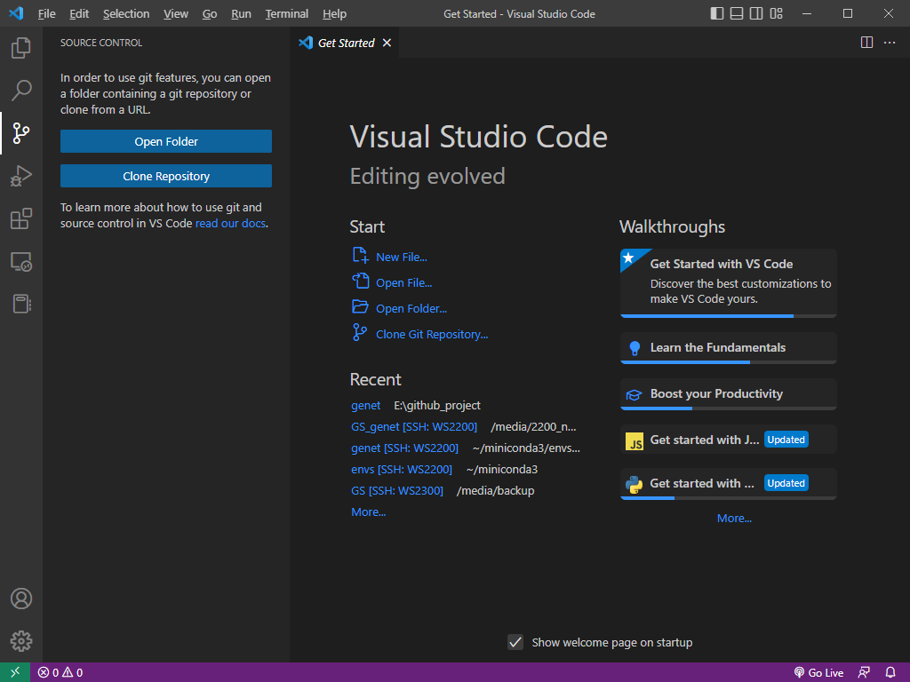
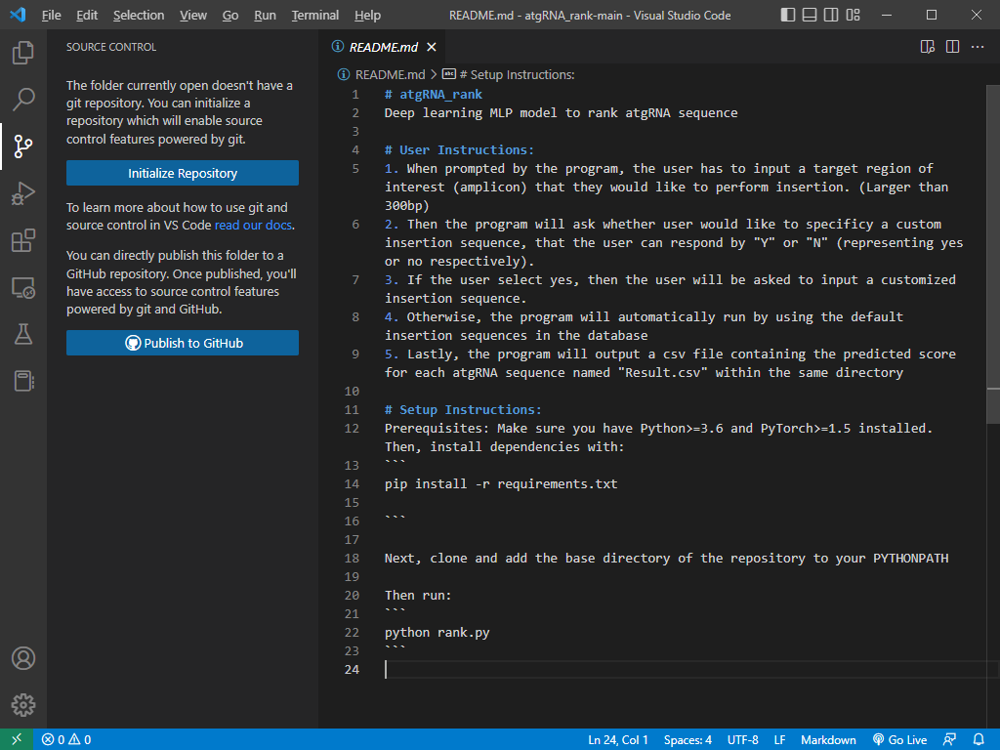
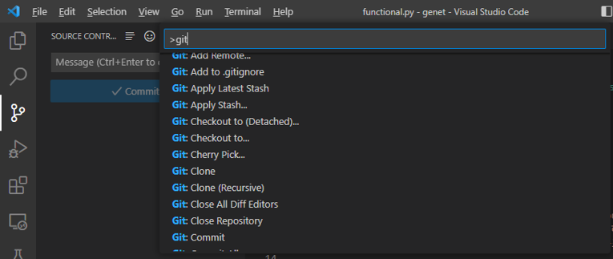
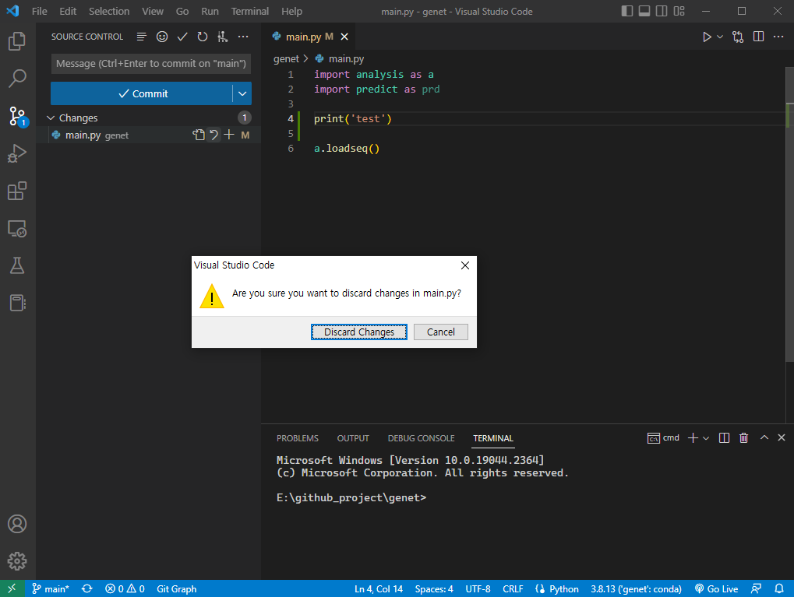
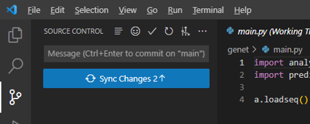

# Git with VS code

VS code는 git을 편하게 사용할 수 있도록 많은 지원하는 기능이 많이 있다. 이는 VS code의 [source control 공식 문서](https://code.visualstudio.com/docs/sourcecontrol/overview)에서도 자세히 소개하고 있다. 본 글에서는 그 중 가장 많이 사용되는 몇 가지 기능에 대해서 소개한다.

우선 git repository로 지정된 폴더를 열거나, 새롭게 GitHub에서 repository를 clone 해야 한다.&#x20;

## Git repository 폴더 열기

<figure><figcaption>
VS code에서 git을 이용해 source code를 관리하는 기능. [Ctrl+Shift+G]로 열 수 있다.
</figcaption></figure>

만약 작업하려는 repository가 아직 clone이 되어있지 않다면 'Clone Repository' 버튼을 클릭해서 가져온 후 폴더를 열어준다. 이미 clone되어 있는 git repository가 있다면, 해당 폴더를 열어준다. 이미 local에 있는 git repository 폴더를 여는 것은 Explorer 창에서도 가능하다.

## Git repository 살펴보기

<figure><figcaption>
Git repository로 연동되지 않은 폴더를 VS code로 열었을 때의 모습.
</figcaption></figure>

만약 git repository가 아닌 폴더를 열었다면 위와 같이 source control 창에서 git system을 인식하지 못하고, 관련 기능을 사용할 수 없다. 만약 이 폴더를 git repository로 설정하고 github 등에 올리고 싶다면, VS code에서도 가능하다.&#x20;

<figure><figcaption>
Git repository로 연동된 폴더를 VS code로 열었을 때의 모습.
</figcaption></figure>

Git repository로 연동된 폴더를 열면, 가장 아래의 상태 표시줄에 현재 branch가 나타난다. 그리고 source control 창을 보면, commit을 할 수 있는 목록과 관련 기능들을 선택할 수 있는 버튼들이 활성화되어 있다.&#x20;

<figure><figcaption>
VS code에서 선택할 수 있는 git command. 명령어 팔레트에서 선택 가능하다.
</figcaption></figure>

Git 명령어들은 VS code에서도 선택해서 실행할 수 있다. VS code의 명령어 팔레트 \[Ctrl+Shift+P]를 열어서 'git'을 검색하면 VS code에서 선택할 수 있는 각종 git 명령어들을 살펴볼 수 있다. Git에서 가장 많이 사용되는 기능은 commit / push / pull 등의 기능들은 GUI로 만들어져 있어서 마우스로 클릭하면서도 실행할 수 있다.&#x20;

## Commit & push 하기

<figure><figcaption>
VS code에서의 source control 화면. 변경 사항이 있는 파일과 그 내용을 볼 수 있다.
</figcaption></figure>

Local 작업을 통해 git repository 안의 파일 중 수정 사항이 있으면, VS code source control 화면에서 해당 파일과 수정 내용을 확인할 수 있다. 각 기능들은 GitHub Desktop과 유사하다.&#x20;

변경 사항이 있는 파일들은 'Changes' 목록에 등록되고, commit을 하고 싶은 변경 파일은 '+' 버튼(Stage Changes)을 클릭해서 stage 상태로 올린다. Commit을 하기 위해서는 가장 위에 있는 'Message'에 commit하는 것에 대해 간단한 내용을 작성하고 commit 버튼을 클릭한다. 또는 commit message를 작성하고 Ctrl+Enter를 누르면 commit된다.

<figure><figcaption>
VS code에서 소스코드의 수정 사항을 취소하는 경우.
</figcaption></figure>

만약 수정된 내용을 commit하지 않고 다시 원래대로 돌리고 싶을 경우, 'Changes'에서 반 시계 방향 화살표를 클릭해서 되돌릴 수 있다.&#x20;

<figure><figcaption>
Sync Changes를 클릭하면 commit한 내용이 push 된다.
</figcaption></figure>

변경 사항을 전부 commit 하거나 되돌렸다면, Sync Changes 버튼이 활성화된다. 이는 commit한 내용을 push 한다는 의미이며, GitHub repository에 commit한 내용을 적용하는 기능이다.&#x20;

## Branch 다루기

[Branch](./#branch) (브랜치 /  분기)는 git에서 가장 중요한 기능 중 하나이다. 특히, 새로운 버전을 개발할 때 시험용 버전으로 사용하거나, 다른 사람과 협업을 하기 위해 특정 파트만 개발하고 나중에 합칠 경우에 branch가 유용하게 사용된다. Git을 사용하는 가장 큰 이유 중 하나이다.

지금까지 위의 예시에서는 'main' branch가 선택되어있다. VS code에서는 현재 이 repository에 있는 branch 중 하나로 선택하거나, 새로운 branch를 만들어서 작업할 수 있다.&#x20;

<figure><figcaption>
새로운 branch 만들기.
</figcaption></figure>

Create Branch... 를 실행해서 새로운 branch를 만들어줄 수 있다. 새로 만드는 branch 이름을 입력해주면 간단하게 생성할 수 있다. 만들어짐과 동시에 가장 하단의 상태 표시줄의 현재 branch가 새로 만들어진 것으로 변경된다.&#x20;

<figure><figcaption></figcaption></figure>

위 그림에서는 새로운 branch로 'dev-analysis-module'를 생성해서 연결한 후, 소스코드를 수정한 상태이다. 왼쪽 하단에 상태 표시줄에서 branch 이름이 변경된 것을 볼 수 있고, commit message를 적는 칸 안에도 commit on "dev-analysis-module" 이라고 적혀있다.&#x20;

이 상태에서 코드를 수정한 후 똑같이 commit 해주면, 'Publish Branch' 버튼이 활성화된다. 이를 누르면 이 branch에서 수정한 내용을 push 하게 된다.&#x20;

## Pull request

<figure><figcaption></figcaption></figure>

이제 GitHub에 들어가 보면, 새로 만든 branch에서 push 했다는 알림이 나타나있다. 또 알림 아래쪽에는 2 branches가 있음을 볼 수 있다. 'Compare & pull request'를 클릭해서 push 한 내용을 확인할 수 있다. 문제 없이 push 내용을 확인했다면 pull request (PR)을 진행한다.&#x20;

Pull request는 현재 버전의 소스코드에 내가 변경한 내용을 최종적으로 병합하는 것을 승인 받기 위한 요청이다. 한번 main branch로 병합되면 앞으로 그 버전이 최신 소스코드로 사용되기 때문에 아주 신중하게 결정되어야 한다. 따라서 pull request에 내용을 적을 때에는 내가 변경한 내용 중 주요 내용을 알기 쉽게 적어서 이 코드를 리뷰할 사람들이 병합을 해도 괜찮을지 판단하기 좋도록 작성해야 한다.&#x20;

<figure><figcaption>
GitHub에서 pull request (PR) 화면.
</figcaption></figure>

Pull request를 완성하면 수정한 코드가 적용된 branch를 어떤 branch에 병합시키려 하는지, 어떤 코드가 어떻게 변경되었는지 등을 볼 수 있다. 그리고 이 요청에 대해 리뷰를 받고 승인을 받아야 비로소 main branch에 병합시킬 수 있다. Merge를 하는 권한에 대해서는 setting에서 [branch protection rule](https://docs.github.com/en/repositories/configuring-branches-and-merges-in-your-repository/defining-the-mergeability-of-pull-requests/managing-a-branch-protection-rule)에서 설정할 수 있다.

## Code review

<figure><figcaption>
Pull request에서 files changed 화면.
</figcaption></figure>

Pull request에서 'Files changed'를 들어가면, 이번 요청에서 변경된 내용을 살펴볼 수 있다. 그리고 이에 대한 리뷰를 남길 수 있는데, 리뷰와 함께 승인을 일정 수 이상 받으면 코드가 병합되어 최종 merge가 된다. 만약 수정 내용에 문제가 없고 합쳐도 좋을 것 같다면 approve를, 코드의 수정이 필요하다면 request changes를 선택한다.&#x20;

하지만 본인이 올린 pull request에 대해서는 승인을 할 수 없다.&#x20;

<figure><figcaption>
코드 리뷰 없이 merge 하기.
</figcaption></figure>

만약 repository의 소유자라면, branch protection rule을 건너뛰고 바로 merge를 할 수 있다. 개인이 혼자 개발한다면 상관없겠지만, 만약 협업을 진행하고 코드리뷰를 하기로 결정한 branch라면 신중히 사용해야 한다.

## Merge

<figure><figcaption>
Merge가 결정 된 pull request.
</figcaption></figure>

코드 리뷰를 받아서 승인을 받거나 강제로 merge를 선택했다면, 해당 pull request의 상태는 merged로 바뀌고 branch는 병합된다. 병합을 마친 branch는 이제 용도를 다 했으니 안전하게 삭제가 가능한 상태로 변경된다. 위 화면에서 delete branch를 클릭하면 병합에 사용된 branch가 삭제된다.&#x20;

<figure><figcaption>
Git graph에서 merge가 잘 이루어진 것을 확인할 수 있다.
</figcaption></figure>

Pull request가 merge로 결정되었다면, GitHub에서나 VS code Git graph 등에서 확인할 수 있다.&#x20;

<figure><figcaption></figcaption></figure>

GitHub에서 published branch를 삭제했더라도 local에서 작업했던 branch는 그대로 남아있다. 사용을 끝낸 local branch를 삭제하기 위해 delete branch를 실행해서 삭제한 branch를 선택해준다.&#x20;

Git은 이와 같은 과정들의 반복이다. 하나의 프로젝트를 위해 다양한 작업들이 많이 필요하니, git을 적극적으로 활용해서 버전 충돌 없이 개발 과정을 편리하게 기록하고 추적하도록 하자.
