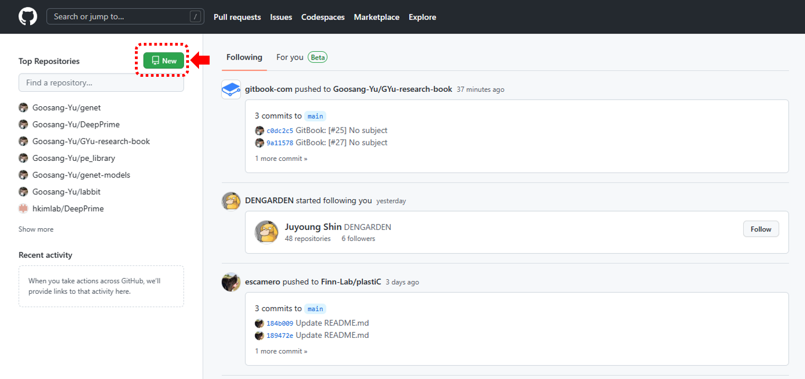
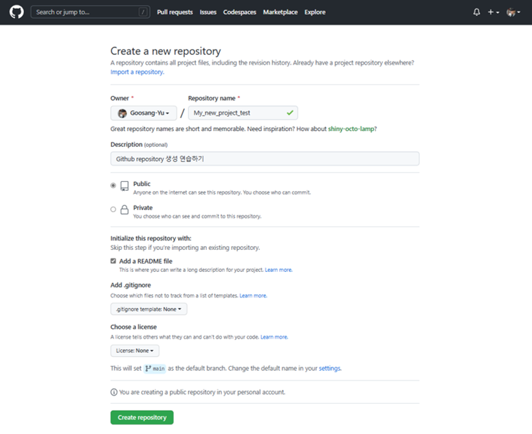
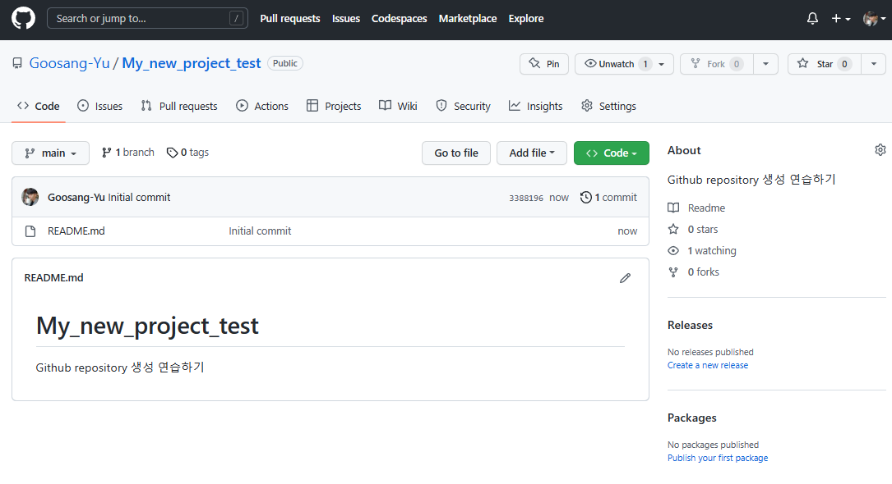

# Github repository

<figure><figcaption>
Github 홈페이지. Sign up을 눌러서 회원가입을 할 수 있다.
</figcaption></figure>

Github을 이용해서 소스코드를 관리하고 저장할 것이기 때문에, 우선 [github에 홈페이지](https://github.com/)에 들어가서 가입한다. 본인이 자주 사용하는 e-mail을 등록하고 이 메일 주소를 이용해 사용자 인증 등의 절차를 거쳐야 한다.

<figure><figcaption></figcaption></figure>

Github에 회원가입 후 로그인 했다면, 본인이 현재 진행하고 있는 프로젝트에 관련된 코드를 저장할 repository (저장소)를 새로 생성한다. 위 화면에서 New를 클릭한다.&#x20;

<figure><figcaption>
새로운 repository를 생성하기 위한 기본 정보들을 입력해준다. 
</figcaption></figure>

## 새로운 repository를 생성

Repository name은 자신의 프로젝트를 잘 나타내는 이름이나 프로젝트에서 개발하고자 하는 프로그램의 이름 등을 적어준다.&#x20;

만약 이 소스코드가 개발 중인 과정도 모두 공개되어도 문제 없다면 public으로 설정하고, 혹시 소스코드가 특허 또는 논문 등에 사용되어야 하는 것이기에 비공개가 필요하다면 Private로 설정해준다.&#x20;

초기 세팅에서 추가해줄 파일들 중 대표적인 것이 'README', '.gitignore', 'license' 파일들이다.&#x20;

README는 자신의 repository에 대한 설명과 개발한 프로그램에 대한 사용법 등을 정리해서 다른 사람들이 이해할 수 있도록 도와주는 문서이다. 이 파일은 마크다운 (markdown) 파일 형식 (.md)으로 작성되는데, 주로 VS code 등의 텍스트 편집기를 통해서 작성해준다.&#x20;

<figure><figcaption>
README에는 각종 소개글과 사용법, 개발자 정보 등을 자유롭게 적어준다.
</figcaption></figure>

'.gitignore'는 git을 이용한 코드 버전관리를 할 때, 특정 파일들은 지정해서 git이 추적하지 않도록 설정하는 파일 목록이다. 예를 들어 연습용 파일이나, 임시 파일 등을 만들어서 사용할 때 여기에 적어둔다.&#x20;

'License'는 이 repository에서 개발하는 프로그램의 저작권에 대한 내용이다. 내용을 직접 쓸 필요 없이 많이 사용되는 template을 선택해서 사용하면 된다. 저작권의 template 종류에 따라서 보호되는 것과 그렇지 않은 것의 차이가 굉장히 크니, 만약 저작권이 중요한 프로젝트의 경우에는 license를 신중히 선택하자. 일반적으로 open-source code 프로젝트를 연구실 수준에서 만드는 것은 MIT license를 사용한다. 마음껏 사용해도 괜찮다는 느낌의 license이다.&#x20;

<figure><figcaption></figcaption></figure>

Create repository를 클릭하면 위와 같이 새로운 나만의 저장소가 생긴다. 이제 이 repository를 git으로 연결해서 소스코드를 원격으로 저장하고 관리할 수 있다. 전문적인 개발자들은 git 명령어를 terminal에서 직접 실행해서 사용하기도 하지만, 요새는 간편하게 사용할 수 있도록 개발된 client 프로그램이 많이 나왔기 때문에 우리는 '[Github desktop](gibhub-desktop.md)'과 '[VS code](git-with-vs-code.md)'을 통해 git을 사용할 것이다.&#x20;
