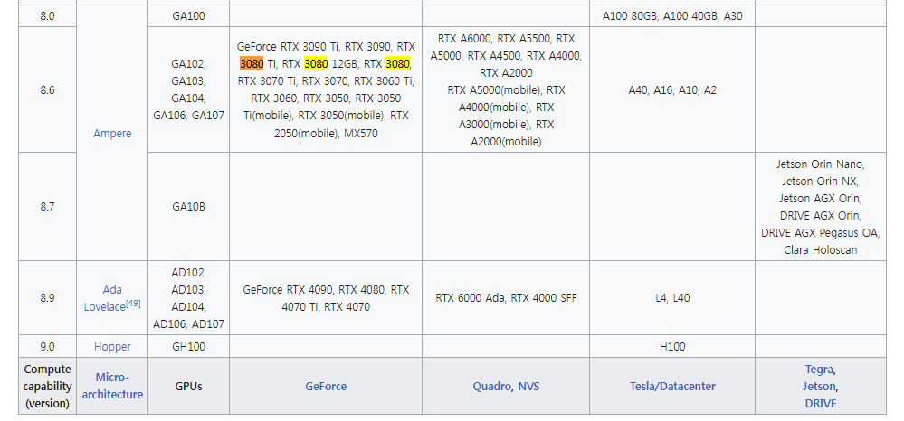
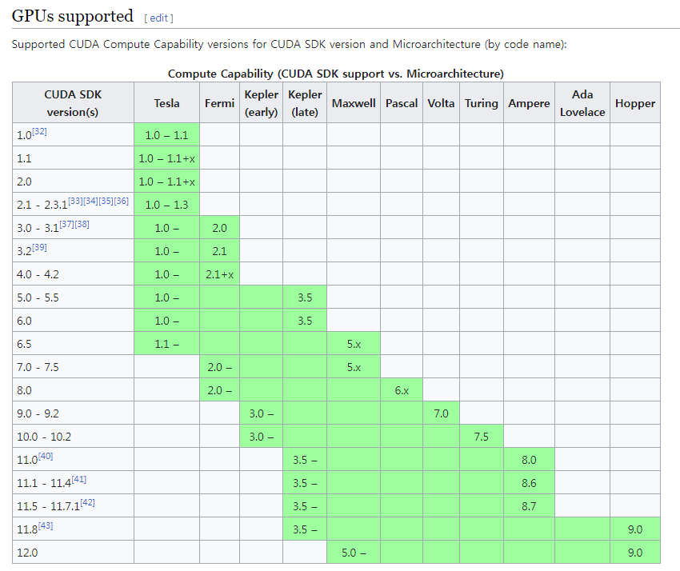
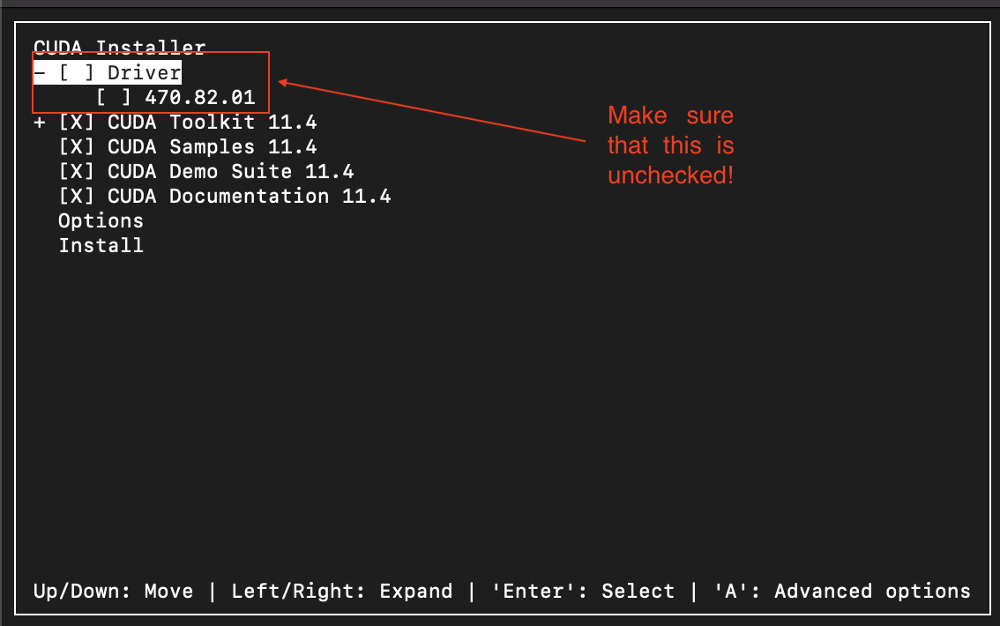

# GPU 개발 환경 구축

최근 다양한 프로그램에서 GPU 연산이 많이 활용되고 있다. 대표적으로 deep learning model 학습에 가장 많이 활용되고 있으며, GROMACS와 같은 시뮬레이션 프로그램에서도 GPU를 활용해서 빠른 연산을 지원하고 있다.&#x20;

## GPGPU

이렇게 GPU를 이용해 연산 속도를 향상시키는 기술을 General-Prupose computing on Graphics Processing Units (GPGPU)라고 한다. 그래픽카드에서 일반적인 다른 연산까지 맡긴다는 의미이다.&#x20;

<figure><figcaption><p>Source: <a href="https://www.nvidia.com/en-us/data-center/tensor-cores/">nvidia.com</a></p></figcaption></figure>

기존에는 영상 데이터의 처리에만 특화된 것으로 여겨졌던 GPU가 다른 연산의 주체가 될 수 있었던 것은 아주 뛰어난 병렬 연산 능력이 있기 때문이다. 특히 이러한 특징은 딥러닝의 수 많은 신경망을 학습할 때 아주 효과적이었다. 최근에는 아예 영상이 아니라 병렬 연산 / 딥러닝에 특화된 프로세서 (tensor core 등)가 개발되고 있다.&#x20;

## CUDA

이러한 GPGPU를 가능하게 해주는 framework가 바로 CUDA (Compute Unified Device Architecture)이다. CUDA는 NVIDIA가 개발한 병렬 컴퓨팅 플랫폼 및 API 모델로, GPU의 가상 명령어셋을 사용할 수 있도록 만들어주는 소프트웨어 레이어이다. 당연히 NVIDIA가 만든 CUDA 코어가 장착된 GPU에 최적화되어있다.&#x20;

<figure><figcaption><p>CUDA on WSL Overview (source: <a href="https://docs.nvidia.com/cuda/archive/11.4.1/wsl-user-guide/index.html">NVIDIA</a>)</p></figcaption></figure>

예를 들어, 그래픽카드가 장착된 컴퓨터에서 Pytorch를 이용한 딥러닝 모델을 개발하고 싶다면, 위와 같은 구조의 시스템 층을 거쳐서 연산이 진행된다. 각 층마다 이전 층들의 버전에 크게 영향을 받기 때문에, 이런 개발 환경을 구축하기 위해서는 버전을 아주 신경써서 맞춰줘야 한다.&#x20;

## CUDA 설치 (Linux)

처음 CUDA 버전을 잡아주고 원하는 병렬 연산 프로그램 개발 환경을 맞추는 것은 꽤 시행착오가 많고 어려운 일이다. 본 글은 이러한 CUDA 환경을 잡는 방법을 하나의 시스템을 예로 들어서 설명한다.&#x20;

### 1) 머신 사양 및 OS 확인

가장 먼저 해야 할 일은 프로그램을 설치할 컴퓨터의 사양과 OS를 체크하는 것이다. 특히 GPU의 모델에 따라서 설치할 수 있는 CUDA 버전이 좌우되기 때문에, 모델명을 확인하는 것이 매우 중요하다. 본 세팅에서 사용한 컴퓨터의 사양은 아래와 같다.&#x20;


**세팅할 머신 사양 (KHB lab workstation 2400)**

CPU: Xeon(R) E5-2630 v3 (2.40GHz)

RAM: 32Gb

GPU: RTX3080

OS: Ubuntu LTS 22.04


### 2) 지원되는 driver / CUDA 버전 확인

사용할 머신의 GPU에 호환되는 nvidia-driver와 CUDA toolkit의 버전을 확인한다.&#x20;

<figure><figcaption><p>GPU 모델에 따른 compute capability version (source: <a href="https://en.wikipedia.org/wiki/CUDA">Wiki</a>)</p></figcaption></figure>

<figure><figcaption><p>각 GPU 세대에 따른 CUDA 지원 버전 표 (source: <a href="https://en.wikipedia.org/wiki/CUDA">Wiki</a>)</p></figcaption></figure>

본 세팅에서 사용할 RTX3080은 8.6세대 GPU (Ampere architecture)이다. 그리고이를 지원하는 CUDA는 11.1 이상이 가능하다.

<figure><figcaption><p>CUDA와 호환되는 Nvidia-driver의 버전 표 (source: <a href="https://docs.nvidia.com/deploy/cuda-compatibility/index.html#abstract">CUDA Compatibility</a>)</p></figcaption></figure>

이러한 CUDA와 호환되는 nvidia-driver 버전을 찾아보니 ([참고](https://docs.nvidia.com/deploy/cuda-compatibility/index.html)), ver. 470 (또는 450) 이상에서 호환되는 것으로 보인다. 다른 사람의 자료 중, [CUDA 11.4와 성공적으로 설치한 자료](https://github.com/ashutoshIITK/install\_cuda\_cudnn\_ubuntu\_20)가 있어서, 본 세팅에서도 CUDA 11.4 + nvidia-driver 470을 설치하는 것으로 결정했다.

### 3) Nvidia-driver 설치

우선 설치를 진행하기 전에 sudo apt update / sudo apt upgrade는 기본적으로 하고 시작한다.

```
sudo apt update
sudo apt upgrade
```

그리고 Nvidia-driver (ver. 470)을 설치하기 위해 다음 명령어를 실행한다.

```
sudo apt install nvidia-driver-470
```

드라이버를 설치 후, 컴퓨터를 재부팅한다 (systemctl reboot now). 그리고 nvidia-smi 명령어를 이용해서 driver가 제대로 설치되었는지 확인한다. 잘 설치되었다면, GPU 설치 목록과 사용률이 나타난다. 그리고 nvidia-smi에는 이 드라이버에 맞는 CUDA 버전을 제시해준다. Nvidia-driver ver. 470의 경우, CUDA Toolkit 11.4에 맞다고 나타난다.&#x20;

### 4) CUDA toolkit 설치

CUDA toolkit이란 개발자들이 nvidia사의 gpu를 사용하기 위한 라이브러리, 컴파일러 등 모든 것들을 제공해주는 툴킷이다. 우리가 흔히 CUDA 버전이라고 말하는 것은 CUDA toolkit을 의미한다.&#x20;

우선 다음의 명령어를 이용하여, nvidia-driver와 맞는 CUDA toolkit run file 설치한다.

```
wget https://developer.download.nvidia.com/compute/cuda/11.4.3/local_installers/cuda_11.4.3_470.82.01_linux.run
```

런 파일 다운로드가 끝난 다음, 다음의이명령어로를 실행하여 CUDA toolkit을 설치한다. 이때, 우리는 앞에서 이미 nvidia-driver 설치가 되었기 때문에,   CUDA toolkit  설할 때 driver는 체크표시를 해제한다.&#x20;

<figure><figcaption><p>Source: <a href="https://github.com/ashutoshIITK/install_cuda_cudnn_ubuntu_20">Github</a></p></figcaption></figure>

설치가 끝난 후, CUDA PATH를 bashrc 파일 환경변수에 추가한다.

```
echo 'export PATH=/usr/local/cuda-11.4/bin:$PATH' >> ~/.bashrc
echo 'export LD_LIBRARY_PATH=/usr/local/cuda-11.4/lib64:$LD_LIBRARY_PATH' >> ~/.bashrc
source ~/.bashrc
sudo ldconfig
```

### 5) Host compiler 맞추기

<figure><figcaption></figcaption></figure>

Nvidia-driver와 CUDA를 성공적으로 설치했더라도, host compiler와의 버전도 맞춰줘야 한다. 여기서 gcc, icc, NVHPC, XLC 등이 host compiler이다.&#x20;

GCC를 대부분 많이 사용하므로, 우리는 gcc/g++에 대해서만 버전을 체크하면 된다. 위 표를 보면, CUDA 11.4를 사용할 때에는 GCC 11 이하로 사용해야 한다고 나와있다. GCC 버전 11.3 같이 더 뒤에 나온 것은 안된다.
