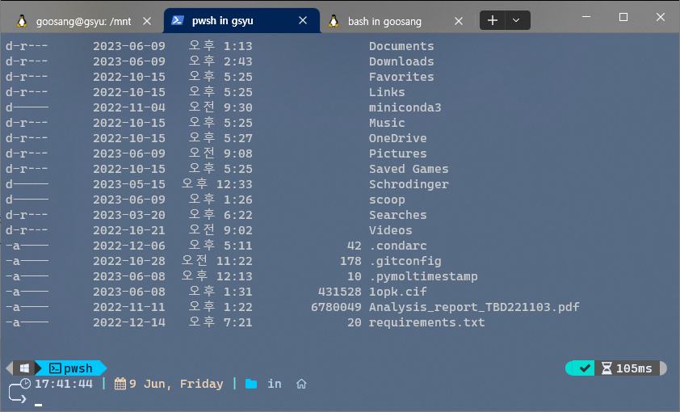

# 기타

## Windows 10 terminal customization

Windows10의 터미널은 깔끔한 UI를 가지고 있긴 하지만, 더 꾸미고 싶다면 [oh-my-posh](https://ohmyposh.dev/docs)라는 패키지를 이용해서 다양한 테마를 적용할 수 있다.&#x20;

<figure><figcaption>
터미널에 kushal 테마를 적용한 모습
</figcaption></figure>

테마 적용 방법은 [이 글](https://kr.moyens.net/how-to/158831/)을 많이 참고했다.
