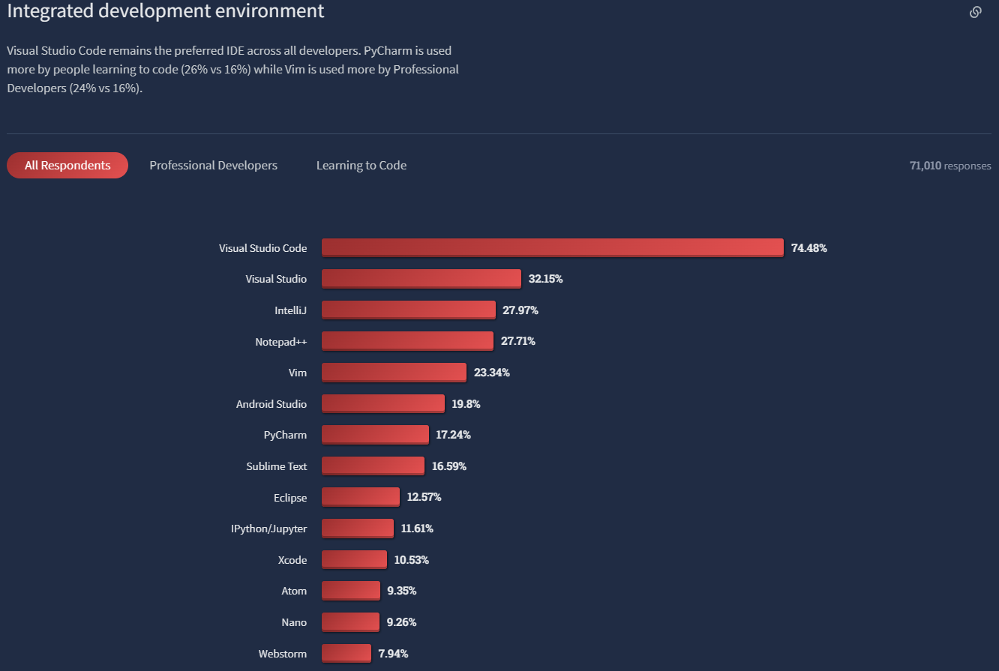
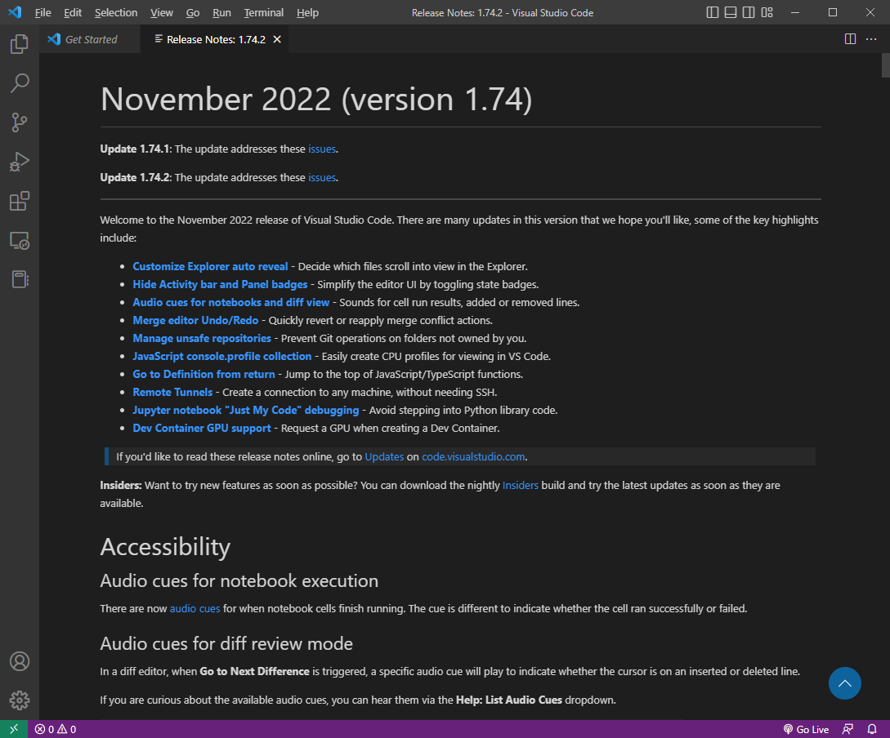

# VS code

<figure><figcaption></figcaption></figure>

## 가장 유명한 개발용 프로그램

Visual Studio (VS) code는 프로그래밍 작업을 할 때 코드를 작성하고 실행해볼 수 있는 기능을 가진 통합 개발 환경 (Integrated Development Environment, IDE) 프로그램이다. Microsoft에서 개발한 것이기 때문에 관리도 아주 훌륭하게 잘 되고 있으며, 기능들을 배울 수 있는 [공식 문서](https://code.visualstudio.com/docs/?dv=win)도 상세하게 잘 작성되어 있다.

굉장히 강력한 기능들을 제공하면서도 무료로 사용할 수 있기에 코딩을 배워가는 학생 뿐 아니라 전문적인 개발자들도 가장 많이 사용하는 IDE이다.&#x20;

<figure><figcaption>
IDE 선호도 순위 (<a href="https://survey.stackoverflow.co/2022/#most-popular-technologies-new-collab-tools">Stackoverflow 2022 Developer survey</a>)
</figcaption></figure>

## 확장 프로그램 (extension)

특히 VS code의 가장 큰 장점 중 하나는 다양한 extension을 제공한다는 것이다. 기본 VS code 설정과 기능에서 세부적으로 필요한 기능들에 대해 설치해 사용할 수 있도록 제공한 것으로, 사용자가 본인의 목적에 맞게 프로그래밍을 할 수 있도록 도와준다. [다양한 extension의 사용 예시](extensions.md)에 대해 따로 정리해두었다.

## 다양한 언어 지원

VS code는 python 뿐만 아니라 C, Java, HTML 등 다양한 언어를 지원해준다. Python 개발에서 많이 추천되는 IDE 중 하나인 pycharm은 python 언어로 작성된 소스코드에 대해서만 개발이 가능하지만, VS code의 경우에는 각 언어에 맞는 extension만 설치해주면 대부분의 언어에 대해서 사용할 수 있다. VS code 하나로 python으로 작성된 machine learning model을 만들고, HTML과 Java script로 작성된 web application을 만드는 등 다양한 작업을 할 수 있다.

## Jupyter notebook 지원

많은 data science 연구자들은 jupyter notebook 형태로 코드를 작성하고 바로 실행 결과를 확인하는 방식을 사용한다. VS code는 jupyter notebook 파일 (.ipynb)을 잘 지원하고 있으며, data science 연구자들도 아주 편리하게 사용할 수 있다.

## 활발한 업데이트

VS code는 업데이트가 매우 활발히 이루어진다. 많은 개발자들이 필요로 하는 기능들을 점점 더 많이 갖춰가고 있으며, 버그에 대한 대응도 굉장히 빠른 편이다.&#x20;

<figure><figcaption>
VS code release note (version 1.7.4.2)
</figcaption></figure>
