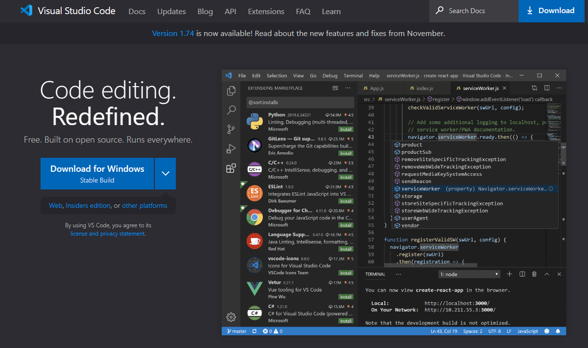
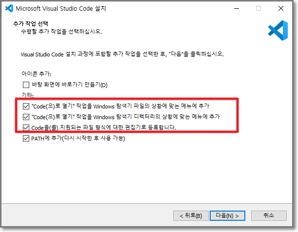
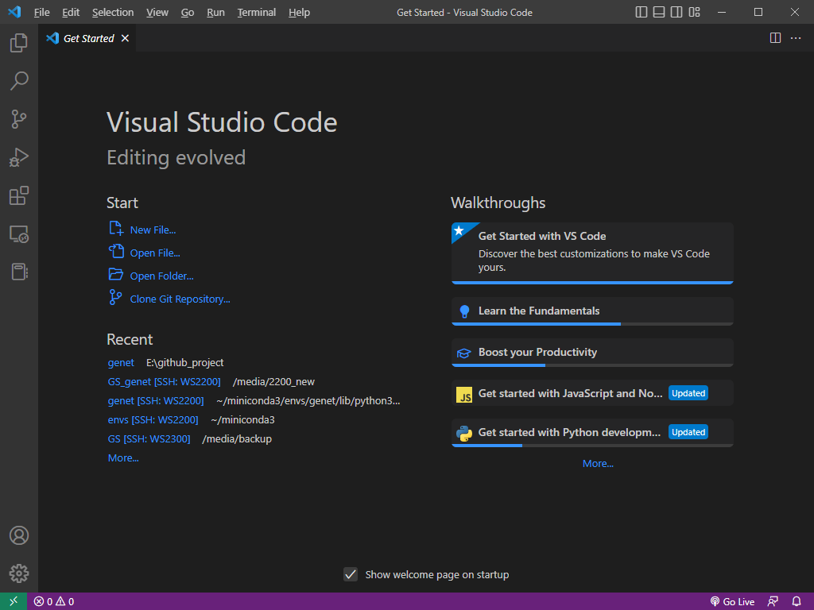

# Installation

VS code는 [공식 홈페이지](https://code.visualstudio.com/)에서 설치 프로그램을 다운로드 받아 간단하게 설지 할 수 있다.&#x20;

<figure><figcaption>
VS code homepage
</figcaption></figure>

Window 운영체제 사용자라면 (ex: window10), 'Download for Windows Stable Build' 버튼을 클릭해서 설치 프로그램을 다운로드 받으면 된다. 다른 운영체제 (Linux or MacOS) 사용자라면, 옆에 화살표를 클릭해서 자신의 컴퓨터 운영체제에 맞는 설치 프로그램으로 다운로드 받는다.&#x20;

<figure><figcaption>
설치 프로그램 실행 중, 설치 옵션을 선택하는 단계
</figcaption></figure>

VS code 설치 프로그램을 실행하고, 대부분은 기본 설정 그대로 진행하면 된다. 단, 위 그림과 같이 추가 작업 선택 부분에서는 빨간 박스 안에 있는 내용들에 체크 표시를 해준다. 체크 표시를 하지 않아도 VS code를 사용하는데 문제가 있는 것은 아니지만, 다양한 상황에서 편리하기 때문에 체크 표시를 권장한다.

<figure><figcaption></figcaption></figure>

설치가 완료되었다면 이제 VS code를 사용할 수 있다.&#x20;
