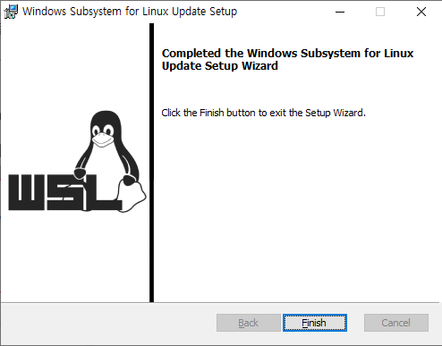
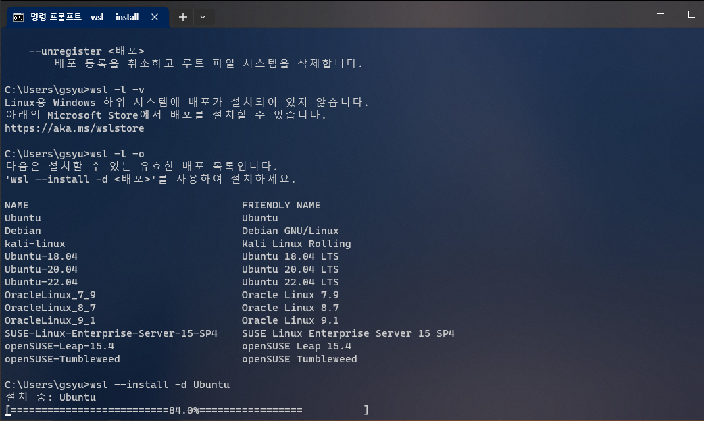
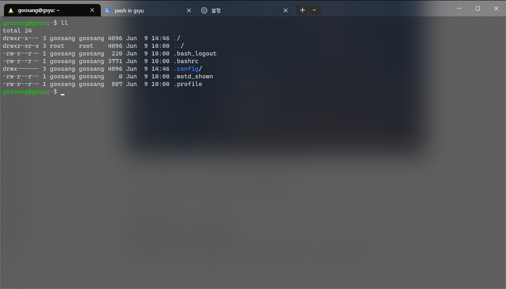

# WSL

Window에서 가상머신을 띄워서 리눅스를 사용하게끔 하는 프로그램은 기존에 많이 존재했으나, 호환성 문제 등으로 안정성이 떨어지고 데이터 처리 등의 속도가 느리다는 한계가 있었다.

그런데 최근 microsoft에서 공식적으로 linux 가상 머신을 띄울 수 있는 프로그램인 WSL을 개발 / 배포해서, 이제 window 사용자들도 손쉽게 리눅스 가상머신을 띄워서 사용할 수 있게 되었다. 본 글은 WSL을 본인의 컴퓨터에 설치하고 사용하는 방법에 대해서 정리한 것이다.&#x20;


글 작성 시점에서 컴퓨터의 하드웨어/소프트웨어 사양은 아래와 같다.&#x20;

```markup
CPU: AMD Ryzen 7 1700
RAM: 16Gb (DDR4)
GPU: Nvidia Quadro M5000
OS: Windows 10 Pro (version 10.0.19044)
```


### 1) WSL 설치

본 내용은 [microsoft의 공식 설치 가이드 문서](https://learn.microsoft.com/ko-kr/windows/wsl/install)를 참고하였다. Windows terminal을 관리자 권한으로 실행해서 아래의 명령어를 실행한다.

```
wsl --install
```

설치된 후 컴퓨터를 다시 시작한다.

### 2) WSL1에서 WSL2로 버전 업그레이드

최신 버전의 OS에서는 WSL2가 기본 설정으로 될 수 있으나, 필자의 경우에는 WSL를 처음 세팅한 후 리눅스를 설치했을 때 WSL1으로 설치되었다. 그래서 WSL2로 업그레이드를 추가로 해주었다. 본 내용은 [WSL 수동 설치에 대한 공식문서](https://learn.microsoft.com/ko-kr/windows/wsl/install-manual#step-4---download-the-linux-kernel-update-package)를 참고하였다.

#### 1단계: Linux용 Windows 하위 시스템 사용

PowerShell을 **관리자 권한(시작 메뉴 > PowerShell >에서 관리자 권한으로 실행 >을 마우스 오른쪽 단추로 클릭)**으로 열고 다음 명령을 입력한다.

```powershell
dism.exe /online /enable-feature /featurename:Microsoft-Windows-Subsystem-Linux /all /norestart
```

#### 2단계: WSL 2 실행을 위한 요구 사항 확인

WSL 2로 업데이트하려면 Windows 10을 실행해야 합니다.

* x64 시스템의 경우: **버전 1903** 이상, **빌드 18362** 이상
* ARM64 시스템의 경우: **버전 2004** 이상, **빌드 19041** 이상

#### 3단계: Virtual Machine 기능 사용

WSL 2를 설치하려면 먼저 **Virtual Machine 플랫폼** 옵션 기능을 사용하도록 설정해야 합니다. 이 기능을 사용하려면 머신에 [가상화 기능](https://learn.microsoft.com/ko-kr/windows/wsl/troubleshooting#error-0x80370102-the-virtual-machine-could-not-be-started-because-a-required-feature-is-not-installed)이 필요하다. PowerShell을 관리자 권한으로 열어 실행합니다.

```powershell
dism.exe /online /enable-feature /featurename:VirtualMachinePlatform /all /norestart
```

#### 4단계: Linux 커널 업데이트 패키지 다운로드

[x64 머신용 최신 WSL2 Linux 커널 업데이트 패키지](https://wslstorestorage.blob.core.windows.net/wslblob/wsl\_update\_x64.msi)를 다운로드 후 설치합니다.&#x20;

<figure><figcaption><p>커널 업데이트를 위해 위 프로그램을 설치한다.</p></figcaption></figure>

#### 5단계: WSL2를 기본 버전으로 설정

PowerShell을 열고 이 명령을 실행하여 새 Linux 배포를 설치할 때 WSL 2를 기본 버전으로 설정한다.

```powershell
wsl --set-default-version 2
```


### 3) WSL에서 linux 배포판 설치

터미널에서 아래 명령어를 사용하면 설치가 가능한 배포 목록을 확인할 수 있다.&#x20;

```
wsl -l -o
```

이제 설치하고 싶은 배포판을 선택해서 WSL에 설치한다. 여기서는 Ubuntu를 설치하였다. 아래의 명령어를 이용하여 설치할 수 있다.

```
wsl --install -d Ubuntu
```


공식 문서에 따르면, 맨 위에서 wsl --install 을 이용해 설치하면 기본적으로 Ubuntu까지 설치된다고 한다. 그래서 기본적으로 처음 설치할 때 배포판 리눅스가 함께 설치되어 있을 수 있다.&#x20;


<figure><figcaption><p>WSL에 Ubuntu를 설치하는 과정</p></figcaption></figure>

아래의 명령어를 사용하면 현재 설치된 OS들을 확인할 수 있다.

```
wsl -l -v
```

### 4) 터미널에서 리눅스 실행하기

이제 우분투가 설치되었다면 windows terminal에서 리눅스 환경으로 개발을 할 수 있다.&#x20;

Terminal의 '설정>프로필'에서도 Linux가 추가된 것을 볼 수 있다. 자신의 기호와 용도에 맞게 설정을 맞춰서 사용해보자.&#x20;

<figure><figcaption><p>윈도우에서 리눅스를 편하게 다룰 수 있다!</p></figcaption></figure>
