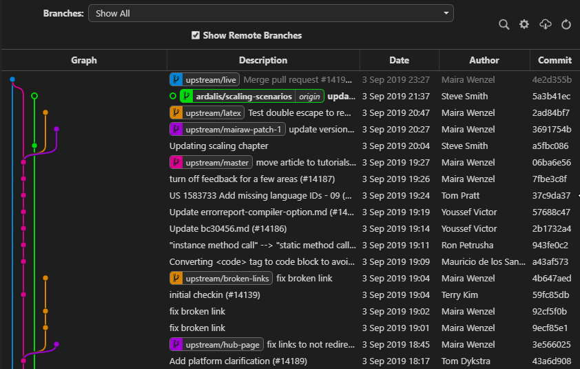
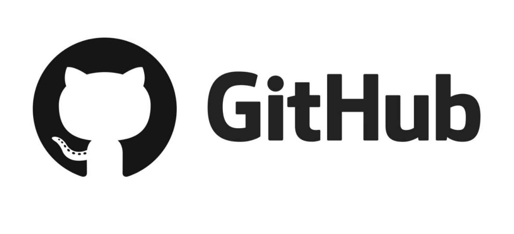

# Git / Github

## Git: 소스코드 버전 관리 시스템

<figure><figcaption></figcaption></figure>

코드를 작성하다 보면 다양한 버전의 코드를 관리해야 하는 경우가 많다. 개발을 진행하면서 점점 수정되는 버전들이 있거나, 다른 사람들과 협업하면서 서로 다른 부분에 대한 코딩을 하는 경우에 이를 통합 관리해줘야 한다. Git은 이러한 소스코드 파일들의 변경 사항을 추적하고, 여러 사용자들 간의 작업을 통합해서 관리해주는 시스템이다.&#x20;

코딩 작업을 많이 하게 된다면, git을 이용한 버전 관리는 필수이다. 코드를 수정하면서 사용하다가 갑자기 예전의 코드의 일부가 필요하게 될 수도 있기 때문이다. 또한 자신의 개발 과정이 어떻게 진행되어왔고, 어떤 부분이 수정되어 왔는지 기록하는 용도로도 중요한 역할을 한다.&#x20;

<figure><figcaption>
Git Graph를 이용해 볼 수 있는 소스코드 버전 개발 현황
</figcaption></figure>

## Github: 소스코드 저장소

<figure><figcaption>
Github의 캐릭터 이름은 옥토캣 (Octocat)이다. 귀여운 얼굴에 그렇지 못한 신체를 가지고 있다...
</figcaption></figure>

Git을 사용해서 추적 / 관리하는 소스코드들은 별도의 저장소에 저장되어야 나중에 필요할 때 불러오거나 최신 코드들과 비교해볼 수 있다. 깃허브 (Github)는 git으로 관리되는 소스코드를 원격으로 연결해서 해당 소스코드 파일을 저장해주는 서비스이다. 2008년에 설립되었으며, 현재 microsoft가 인수했다.

Git을 기반으로 저장소를 제공해주는 서비스는 github 말고도 몇 가지 종류가 더 있다. 특히 기업에서 사용되는 저장소인 '[Bitbucket](https://www.atlassian.com/ko/software/bitbucket)'이 대표적이다. 하지만 Bitbucket은 공동 작업자가 5명을 넘어갈 경우에는 유료로 사용해야 한다. Github이 가장 대중적으로 많이 사용되고 자료도 많이 있으므로 추천하는 저장소이다.&#x20;

