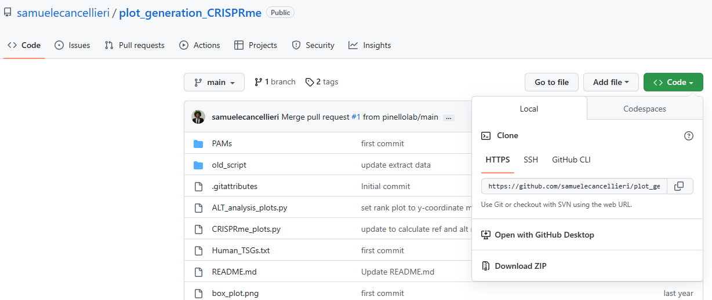
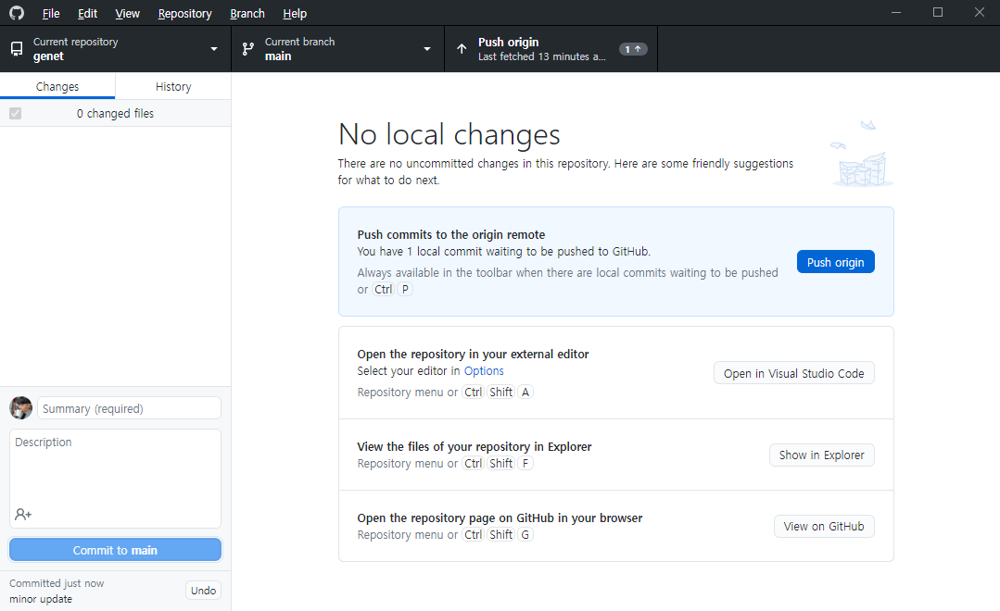

# Gibhub desktop

Git을 사용하기 위해서는 git 명령어를 통해 원하는 소스코드 파일을 push / commit 해줘야 한다. 하지만 git 명령어를 매번 터미널에 입력해주는 것이 번거롭거나 익숙하지 않다면, 훨씬 더 직관적으로 사용할 수 있도록 도와주는 client 프로그램들이 나와있다.&#x20;

Github Desktop은 github에서 만든 GUI 프로그램이며, git 명령어를 정확히 알고 있지 않더라도 git을 사용하고 소스코드 파일을 관리할 수 있도록 도와준다. Github Desktop은 [공식 홈페이지](https://desktop.github.com/)에서 쉽게 설치가 가능하다.

## Github 저장소와 연동하기

<figure><figcaption>
Github desktop을 설치한 후 처음 화면. Github 계정으로 로그인 해야 한다.
</figcaption></figure>

우리가 프로젝트를 진행하는 코드를 저장하는 repository가 github에 있다면, 이를 우리가 실제로 작업할 컴퓨터 (local)에 복사해서 가져와야 한다. 이렇게 복사해서 local 컴퓨터에 저장하는 과정을 'clone' 이라고 한다. Github desktop을 처음 설치하면, github과 연동된 repository가 하나도 없을테니, 새 repository를 만들거나 github에 있는 repository를 clone  해야 한다.&#x20;

<figure><figcaption>
Github desktop에 로그인 후 첫 화면. Repository 연동을 위한 메뉴가 보인다.
</figcaption></figure>

대부분의 경우, github에 만들어져 있는 repository를 clone해서 가져올 때가 많다. 이 repository는 자신의 계정이 소유하고 있는 것일 수도 있고, 다른 개발자의 repository를 다루기 위해 가져올 수도 있다. 우선 clone을 위해서 'Clone a repository from the Internet'을 클릭한다.

## 본인의 github repository를 clone하기

<figure><figcaption>
Repository를 clone해오기 위해 선택하는 화면.
</figcaption></figure>

Clone a repository 화면을 보면, 지금 내 github에 저장되어있는 모든 repository 목록이 나온다. 이 중 하나를 클릭해서 선택하고, 'Local path'로 어느 폴더로 옮겨 담을지 선택해서 'Clone' 버튼을 누르면 연동이 진행된다.&#x20;

위 목록을 보면, repository의 계정 이름이 다른 것들이 몇 개 있다 (hkimlab, yumin-c). 이것들은 다른 사람의 repository에 있는 소스코드에 대해서 내가 작업에 참여하여 'contributor'로 속해있는 것들이 나타난 것이다.


이때, Local path의 폴더 이름이 꼭 repository의 이름과 같을 필요는 없다. 만약 DeepPE 라는 이름의 repository를 \~/DeepPE\_dev221229 등의 경로에 저장해줘도 문제 없이 clone이 된다.


## 다른 사람의 github repository를 clone 하기

<figure><figcaption>
원하는 repository의 URL이나 Github username을 알고 있으면 공개된 repository를 clone 해올 수 있다.
</figcaption></figure>

다른 사람의 repository에 공개된 파일들을 작업하고 싶다면, URL 또는 Github 사용자 이름과 repository 이름을 통해 가져올 수 있다. &#x20;

<figure><figcaption>
Github repository에서 'Code'를 누르면 clone 할 수 있는 기능이 제공된다.
</figcaption></figure>

Github 웹페이지에서 clone 하고 싶은 repository에 들어간 후, 'Code'를 누르면 clone에 필요한 URL을 알 수 있다. HTTPS에 있는 링크 주소를 github desktop의 URL 주소 창에 넣고 local path를 지정해주면 clone해 올 수 있다. 직접 입력해주지 않아도 'Open with GitHub Desktop'을 눌러도 clone해올 수 있다.&#x20;

## Github Desktop에서 git 사용하기

<figure><figcaption>
GitHub desktop에서 repository를 선택했을 때의 화면.
</figcaption></figure>

GitHub desktop에서 repository를 clone해서 내 local 컴퓨터에 저장했다면, 위와 같은 화면에서 내 코드의 수정 사항을 볼 수 있다. 수정 전의 코드는 붉은 색으로, 수정 후의 코드는 초록 색으로 표시된다. 아직 GitHub에 커밋하지 않은 수정된 내용들은 화면 왼쪽의 'Changes'에 표시된다.&#x20;

Changes 목록에서 체크 표시되어있는 것들은 commit을 할 때 들어갈 파일들을 의미한다. 만약 전체 수정 내용 중 일부만 commit하고 싶다면, 원하는 파일들만 체크 표시를 해두면 된다.&#x20;

Commit을 하고 싶다면, 화면 왼쪽 아래에 Summary (required) 칸에 작업 내용에 대한 간단한 명칭을 적어주고 아래 쪽에 'Commit to main'을 클릭하면 된다. 만약 현재 선택되어 있는 branch가 main이 아니라 다른 분기라면 선택된 branch에 commit하게 된다. Commit 버튼 위에 Description은 작업 내용에 대한 자세한 내용을 적는 칸이지만, 필수는 아니다.&#x20;

<figure><figcaption>
Commit을 완료한 후 push 대기 중인 상태.
</figcaption></figure>

변경 사항에 대해 commit을 완료하면, changes에 있던 내역이 사라지고, push origin이 활성화된다. 내가 commit한 내용을 현재 branch (main)에 합치겠다는 의미이다. Push origin을 누르지 않으면, 내가 local에서 작업한 내용이 아직 GitHub repository에 적용되지 않는다. Push origin을 상단의 검은색 메뉴바 혹은 중앙에 파란색 버튼을 눌러서 실행할 수 있다. Push에 성공했다면, GitHub repository에 내가 수정한 내용이 잘 적용된 것을 확인할 수 있다.&#x20;
