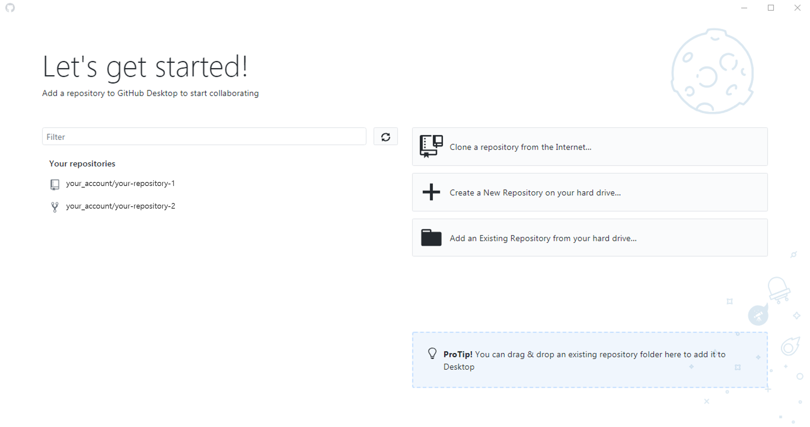
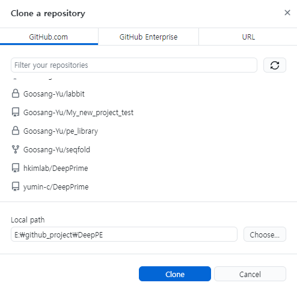
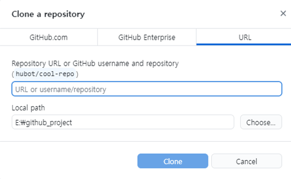

# Gibhub desktop

Git을 사용하기 위해서는 git 명령어를 통해 원하는 소스코드 파일을 push / commit 해줘야 한다. 하지만 git 명령어를 매번 터미널에 입력해주는 것이 번거롭거나 익숙하지 않다면, 훨씬 더 직관적으로 사용할 수 있도록 도와주는 client 프로그램들이 나와있다.&#x20;

Github Desktop은 github에서 만든 GUI 프로그램이며, git 명령어를 정확히 알고 있지 않더라도 git을 사용하고 소스코드 파일을 관리할 수 있도록 도와준다. Github Desktop은 [공식 홈페이지](https://desktop.github.com/)에서 쉽게 설치가 가능하다.

## Github 저장소와 연동하기

<figure><figcaption>
Github desktop을 설치한 후 처음 화면. Github 계정으로 로그인 해야 한다.
</figcaption></figure>

우리가 프로젝트를 진행하는 코드를 저장하는 repository가 github에 있다면, 이를 우리가 실제로 작업할 컴퓨터 (local)에 복사해서 가져와야 한다. 이렇게 복사해서 local 컴퓨터에 저장하는 과정을 'clone' 이라고 한다. Github desktop을 처음 설치하면, github과 연동된 repository가 하나도 없을테니, 새 repository를 만들거나 github에 있는 repository를 clone  해야 한다.&#x20;

<figure><figcaption>
Github desktop에 로그인 후 첫 화면. Repository 연동을 위한 메뉴가 보인다.
</figcaption></figure>

대부분의 경우, github에 만들어져 있는 repository를 clone해서 가져올 때가 많다. 이 repository는 자신의 계정이 소유하고 있는 것일 수도 있고, 다른 개발자의 repository를 다루기 위해 가져올 수도 있다. 우선 clone을 위해서 'Clone a repository from the Internet'을 클릭한다.

## 본인의 github repository를 clone하기

<figure><figcaption>
Repository를 clone해오기 위해 선택하는 화면.
</figcaption></figure>

Clone a repository 화면을 보면, 지금 내 github에 저장되어있는 모든 repository 목록이 나온다. 이 중 하나를 클릭해서 선택하고, 'Local path'로 어느 폴더로 옮겨 담을지 선택해서 'Clone' 버튼을 누르면 연동이 진행된다.&#x20;


이때, Local path의 폴더 이름이 꼭 repository의 이름과 같을 필요는 없다. 만약 DeepPE 라는 이름의 repository를 \~/DeepPE\_dev221229 등의 경로에 저장해줘도 문제 없이 clone이 된다.


## 다른 사람의 github repository를 clone 하기

<figure><figcaption>
원하는 repository의 URL이나 Github username을 알고 있으면 공개된 repository를 clone 해올 수 있다.
</figcaption></figure>

