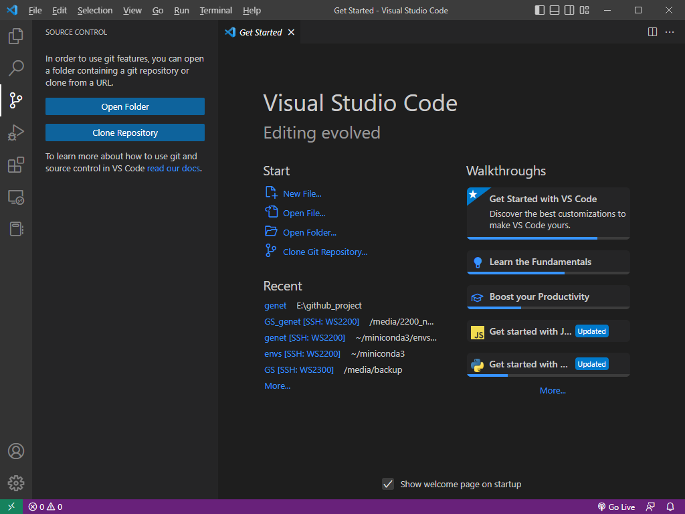
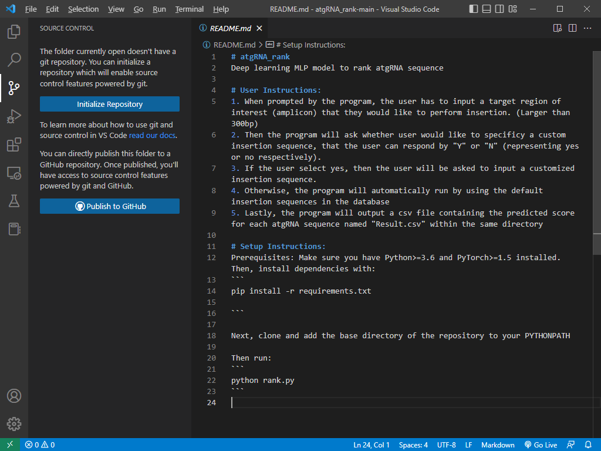
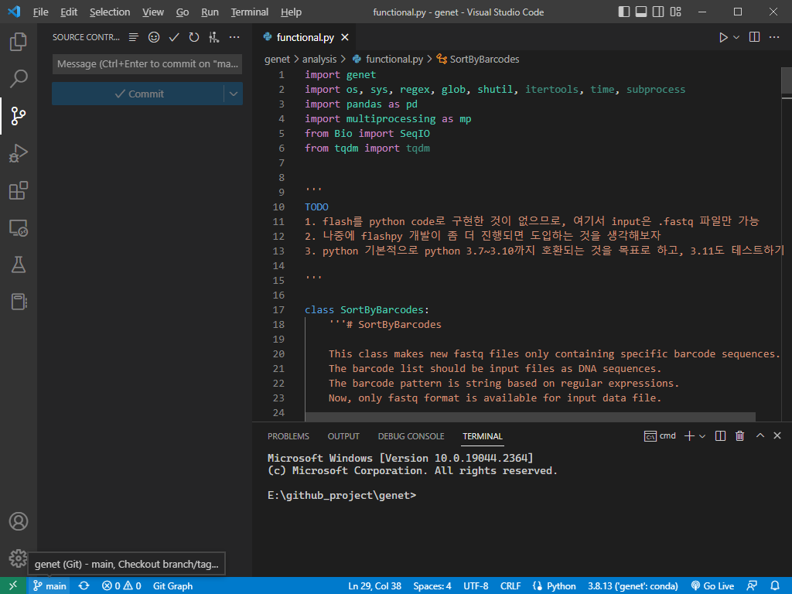
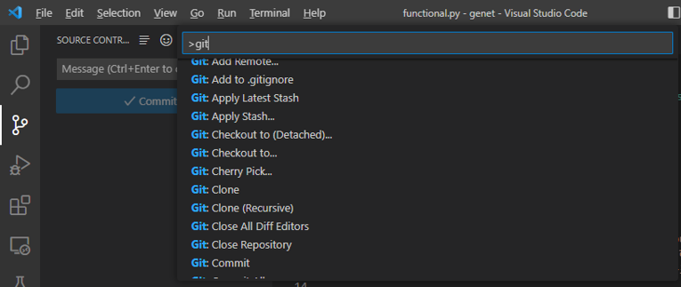
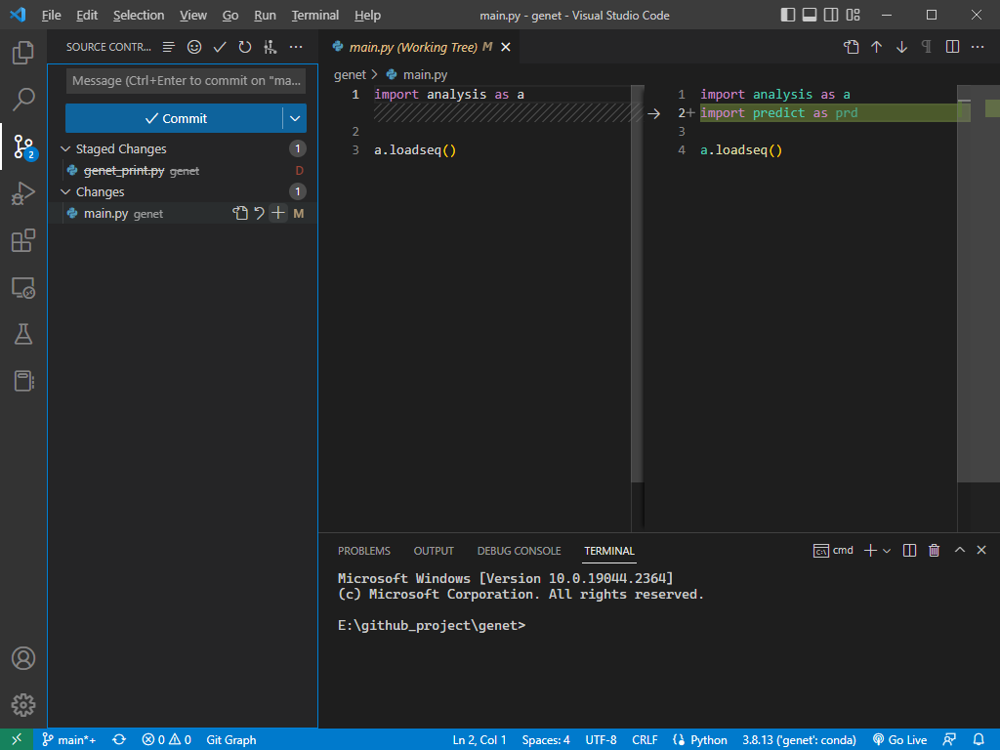
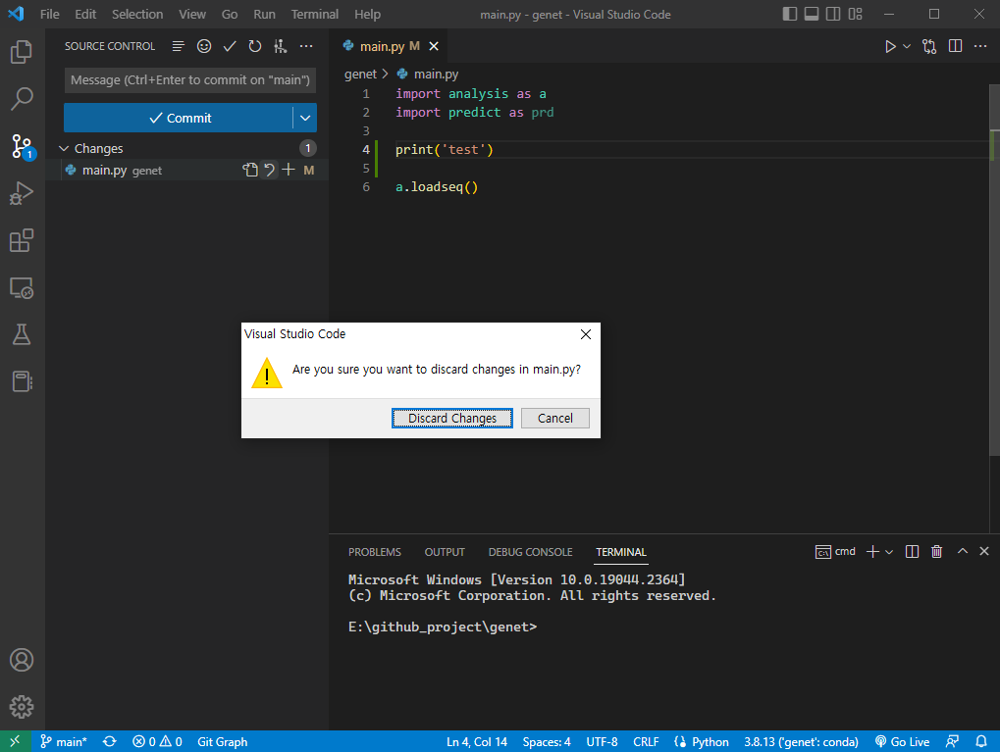
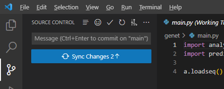

# Git with VS code

VS code는 git을 편하게 사용할 수 있도록 많은 지원하는 기능이 많이 있다. 우선 git repository로 지정된 폴더를 열거나, 새롭게 GitHub에서 repository를 clone 해야 한다.&#x20;

## Git repository 폴더 열기

<figure><figcaption>
VS code에서 git을 이용해 source code를 관리하는 기능. [Ctrl+Shift+G]로 열 수 있다.
</figcaption></figure>

만약 작업하려는 repository가 아직 clone이 되어있지 않다면 'Clone Repository' 버튼을 클릭해서 가져온 후 폴더를 열어준다. 이미 clone되어 있는 git repository가 있다면, 해당 폴더를 열어준다. 이미 local에 있는 git repository 폴더를 여는 것은 Explorer 창에서도 가능하다.

## Git repository 살펴보기

<figure><figcaption>
Git repository로 연동되지 않은 폴더를 VS code로 열었을 때의 모습.
</figcaption></figure>

만약 git repository가 아닌 폴더를 열었다면 위와 같이 source control 창에서 git system을 인식하지 못하고, 관련 기능을 사용할 수 없다. 만약 이 폴더를 git repository로 설정하고 github 등에 올리고 싶다면, VS code에서도 가능하다.&#x20;

<figure><figcaption>
Git repository로 연동된 폴더를 VS code로 열었을 때의 모습.
</figcaption></figure>

Git repository로 연동된 폴더를 열면, 가장 아래의 상태 표시줄에 현재 branch가 나타난다. 그리고 source control 창을 보면, commit을 할 수 있는 목록과 관련 기능들을 선택할 수 있는 버튼들이 활성화되어 있다.&#x20;

<figure><figcaption>
VS code에서 선택할 수 있는 git command. 명령어 팔레트에서 선택 가능하다.
</figcaption></figure>

Git 명령어들은 VS code에서도 선택해서 실행할 수 있다. VS code의 명령어 팔레트 \[Ctrl+Shift+P]를 열어서 'git'을 검색하면 VS code에서 선택할 수 있는 각종 git 명령어들을 살펴볼 수 있다. Git에서 가장 많이 사용되는 기능은 commit / push / pull 등의 기능들은 GUI로 만들어져 있어서 마우스로 클릭하면서도 실행할 수 있다.&#x20;

## Commit & push 하기

<figure><figcaption>
VS code에서의 source control 화면. 변경 사항이 있는 파일과 그 내용을 볼 수 있다.
</figcaption></figure>

Local 작업을 통해 git repository 안의 파일 중 수정 사항이 있으면, VS code source control 화면에서 해당 파일과 수정 내용을 확인할 수 있다. 각 기능들은 GitHub Desktop과 유사하다.&#x20;

변경 사항이 있는 파일들은 'Changes' 목록에 등록되고, commit을 하고 싶은 변경 파일은 '+' 버튼(Stage Changes)을 클릭해서 stage 상태로 올린다. Commit을 하기 위해서는 가장 위에 있는 'Message'에 commit하는 것에 대해 간단한 내용을 작성하고 commit 버튼을 클릭한다. 또는 commit message를 작성하고 Ctrl+Enter를 누르면 commit된다.

<figure><figcaption>
VS code에서 소스코드의 수정 사항을 취소하는 경우.
</figcaption></figure>

만약 수정된 내용을 commit하지 않고 다시 원래대로 돌리고 싶을 경우, 'Changes'에서 반 시계 방향 화살표를 클릭해서 되돌릴 수 있다.&#x20;

<figure><figcaption></figcaption></figure>

변경사항을 전부 commit 하거나 되돌렸다면, Sync Changes 버튼이 활성화된다. 이는 commit한 내용을 push 한다는 의미이며, GitHub repository에 commit한 내용을 적용시키는 기능이다.&#x20;

## Branch 다루기

Branch는 git에서 가장 중요한 기능 중 하나이다. 위의 예시에서는 'main' branch가 선택되어있다.  Branch는 현재 이 repository에 있는 branch 중 하나로 선택하거나, 새로운 branch를 만들어서 작업할 수 있다.&#x20;

