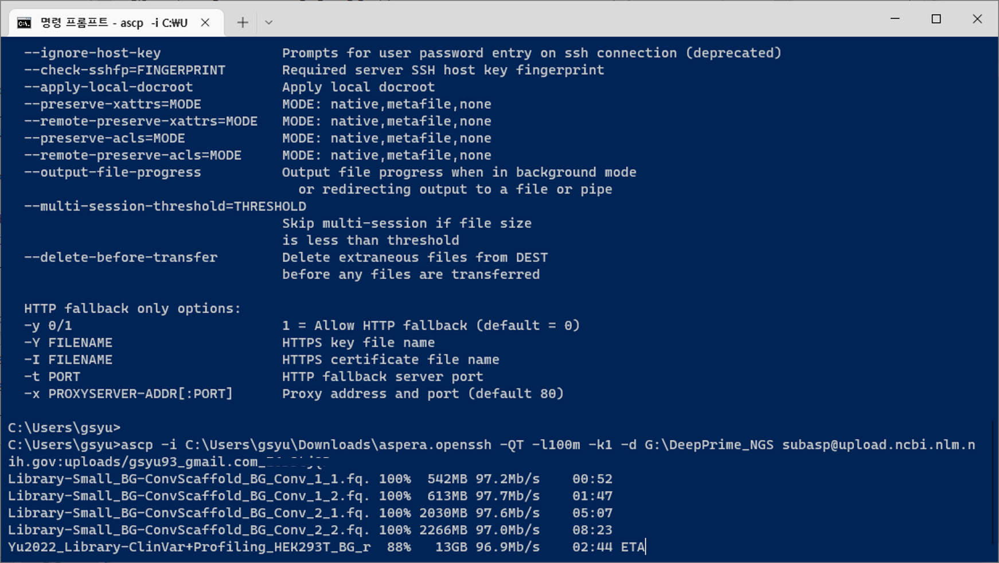

# SRA file upload

자기가 논문을 낼 준비를 하고 있고 논문에 sequencing data가 있다면, 대부분의 경우 그 데이터를 공개된 데이터 저장소에 등록해서 다른 연구자들이 원할 때 바로 다운로드 받아서 분석할 수 있도록 제공해야 한다. 그리고 그 저장소로 사용되는 대표적인 것이 SRA이다.

SRA에 업로드 하는 방법은 몇 가지 선택지가 있는데, 그 중 가장 많이 사용되는 것은 FTP를 이용한 방법이다.&#x20;

## FTP를 이용한 파일 업로드

FTP는 간편하게 많이 사용되는 데이터 전송 방식으로, 이를 잘 설명한 자료도 풍부할 뿐 아니라 관련 프로그램도 잘 갖춰져 있다.


## Aspera를 이용한 파일 업로드

Upload 방법으로 기존에 많이 사용되던 방법은 FTP 전송이지만, 이는 속도가 꽤 느리기 때문에 파일이 많거나 용량이 매우 큰 경우에는 어려움이 많다. Aspera는 FTP보다 훨씬 빠른 전송 방식으로 업로드할 수 있는 기술이며, SRA에서 추천하는 방법 중 하나이다. 다만 사용법에 대해서 문서화가 자세하게 정리되어있지 않아 진입장벽이 높다.

본 protocol은 window 환경에서 Aspera command를 이용해서 업로드 하는 방법을 기준으로 기술되었다. 다른 OS에서는 방법이 다를 수 있으므로, 관련 자료를 찾아서 그에 맞게 적용해야 한다.

### Installation

이 내용은 공식 문서상으로 나와있는 것이 없으며, 박진만 선생님이 세팅한 내용을 기초로 작성되었다.

1. IBM Aspera Desktop Client를 다운로드한다. (IBM Aspera Desktop Client - Download now)

<figure><figcaption><p>Aspera download page (IBM)</p></figcaption></figure>

2\. Aspera Desktop Client 중 window 전용 프로그램으로 최신버전을 선택한다.

<figure><figcaption><p>Aspera 설치 프로그램, 각 운영체제 (OS)에 따라서 각각 프로그램을 다운로드 받을 수 있다.</p></figcaption></figure>

3\. 이때 IBM 계정이 필요하므로 회원 가입을 먼저 진행한다. 비밀번호는 최소 1개 이상의 대문자와 특수 문자를 포함해야 한다.

<figure><figcaption><p>IBM 로그인 화면, 계정이 없다면 'IBMid 생성'을 눌러서 생성한다.</p></figcaption></figure>

4\. 회원 가입을 성공적으로 마쳤다면, 프로그램을 다운로드 받을 수 있다.

<figure><figcaption><p>선택한 설치 프로그램을 다운로드 받을 수 있는 화면. 여기서는 window 설치용으로 선택하였다.</p></figcaption></figure>

5\. 설치 프로그램을 관리자 권한으로 실행해서 설치를 진행하자.

<figure><figcaption><p>다운로드 받은 설치 프로그램. 이를 관리자 권한으로 실행한다.</p></figcaption></figure>

<figure><figcaption><p>설치 프로그램을 실행하면 아래와 같이 나타난다. 일반 설치로 진행한다.</p></figcaption></figure>

6\. 설치하려면 새로운 account를 입력하라고 뜨는데, 이건 위에서 가입했던 IBM 계정과는 별개이다. 자신을 나타내는 이름과 암호를 입력한다.

<figure><figcaption><p>만약 이전에 설치했던적이 있다면, 그때 사용한 계정을 입력하면 된다. 처음 설치하고 사용하는 것이라면 신규 가입한다는 생각으로 입력한다.</p></figcaption></figure>

<figure><figcaption><p>처음 설치하는 중이라면, user를 찾을 수 없으며, 새로 등록한다는 창이 뜬다. ‘예’를 눌러서 넘어가자.</p></figcaption></figure>

7\. Install을 누르면 본격적으로 설치가 진행된다. 설치 과정은 이것으로 끝이다.

<figure><figcaption><p>위 화면에서 install을 누른다.</p></figcaption></figure>

### Aspera Command-Line upload 하기

1. 위 과정을 문제 없이 따라왔다면, Aspera가 로컬 컴퓨터에 잘 설치되었을 것이다. Aspera Desktop Client GUI 프로그램을 사용할 수도 있지만, SRA에서 제공하는 것은 command-line 기반의 업로드 방식이기 때문에 이를 따라 터미널에서 실행한다. 명령  프롬프트 (cmd)를 실행해서 아래의 명령어를 실행해보자.

```
> ascp -h
```

<figure><figcaption><p>IBM Aspera를 프롬프트 창에서 실행한 것. -h 옵션은 도움말을 의미한다. 위 프롬프트는 microsoft store에서 신형 터미널 앱을 다운로드 받은 것이며, 기능은 기존의 cmd과 동일하다.</p></figcaption></figure>

위와 같은 화면이 나타났다면 Aspera가 정상적으로 설치된 것이다. 만약 제대로 명령어가 실행되지 않았다면 설치가 제대로 되지 않은 것이니, 설치 과정을 다시 잘 진행해보자.

2\. SRA submission portal에 나와 있는대로 Aspera Command-Line upload 과정을 진행한다. 해당 페이지에 나와있는 설명을 보면, 아래의 명령어를 실행하라고 적혀있다.

<figure><figcaption><p>NCBI의 submission portal에서 SRA에 파일을 올리는 방법을 설명하는 화면. 이 중 Aspera Command-Line upload 방법을 살펴보자.</p></figcaption></figure>

```
> ascp -i <path/to/key_file> -QT -l100m -k1 -d <path/to/folder/containing files> subasp@upload.ncbi.nlm.nih.gov:uploads/<XXXX_XXX.XXX_XXXXXX>
```

위 명령어에서 사용자가 채워넣어야 할 것은 딱 2가지이다. \<path/to/key\_file>과 \<path/to/folder/containing files>가 그것이다.

3\. key file은 submission portal에서 key file 다운로드 link가 걸려있는 것을 클릭해서 다운로드 받을 수 있다. 이를 다운로드 받고 파일을 우클릭해서 '속성'을 열어서 파일 위치와 파일 이름을 이어서 입력해준다.&#x20;

<figure><figcaption><p>Submission portal에서 다운로드 받은 aspera.openssh 파일의 속성.파일 위치\파일이름 순으로 연결해서 &#x3C;path/to/key_file>부분에 넣어준다.</p></figcaption></figure>

4\. 다음은 \<path/to/folder/containing files> 이다. 이것은 내가 업로드하려는 파일들이 들어있는 폴더의 경로를 의미한다. 업로드 할 모든 파일이 하나의 폴더 안에 함께 들어있어야 한다.

<figure><figcaption><p>업로드 할 파일들이 모여있는 폴더. 이 폴더의 경로를 넣어준다.</p></figcaption></figure>

위 예시 그대로 명령어를 작성하면 아래와 같다.&#x20;

```
> ascp -i C:\Users\gsyu\Downloads\aspera.openssh -QT -l100m -k1 -d G:\DeepPrime_NGS subasp@upload.ncbi.nlm.nih.gov:uploads/<XXXX_XXX.XXX_XXXXXX>
```

<figure><figcaption><p>Aspera 명령어를 이용해서 파일을 SRA 서버에 업로드 하는 모습. 자신의 인터넷 환경에서 가능한 최고 수준의 속도로 업로드가 가능하다.</p></figcaption></figure>


